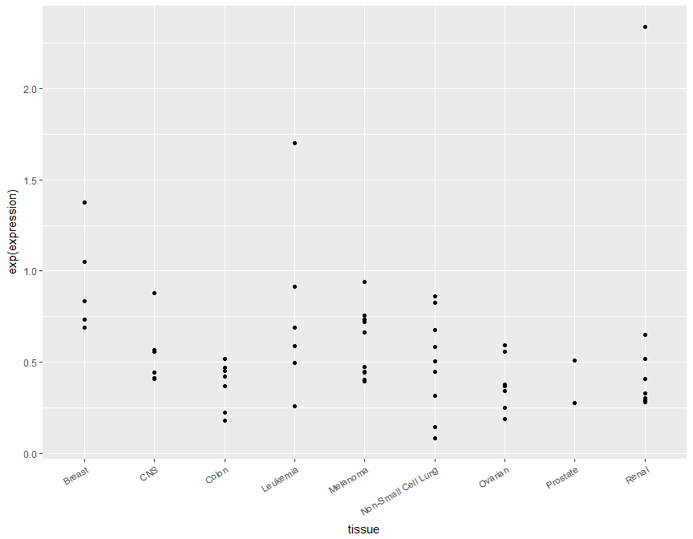
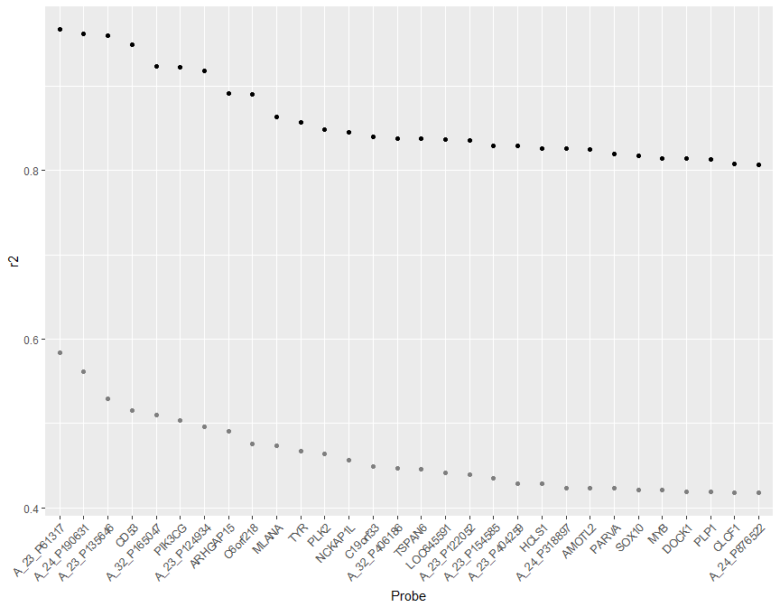

# Introduction to R
Zhaohu(Jonathan) Fan  


# Activity 1: Stocks & Dividends
### Getting Price Data


```r
# choose companies of interest
companies <- c("F", "MMM", "GE")

Prices <- read_stock_prices(companies, what = "daily", start_year = 2000, end_year = 2016)

# inspect data
head(Prices)
```

```
##    open  high   low close   volume adj_close company       date
## 1 12.11 12.40 12.05 12.39 32024800  11.78287       F 2016-02-25
## 2 12.11 12.11 11.60 12.08 60608400  11.48806       F 2016-02-24
## 3 12.53 12.65 12.42 12.42 30136700  11.81139       F 2016-02-23
## 4 12.10 12.56 12.10 12.56 33549700  11.94454       F 2016-02-22
## 5 12.19 12.22 12.01 12.10 26479300  11.50708       F 2016-02-19
## 6 12.40 12.44 12.12 12.26 28784700  11.65924       F 2016-02-18
```

```r
# chart close vs date for each company
Prices %>%
  ggplot(aes(x = date, y = close)) + 
  geom_line(aes(color = company))
```

<!-- -->


### Buy/Sell Profit


```r
Actions <- 
  data.frame(
    action = c("buy", "sell"), 
    date = ymd(c("2008-07-14", "2015-12-16"))
  )

# Combine the Prices & Actions tables
SalesDifference <- 
  Prices %>%
  inner_join(Actions) %>%
  select(company, action, close) %>%
  spread(key = action, value = close) %>%
  mutate(profit = sell - buy)

# inspect the data table
SalesDifference
```

```
##   company   buy   sell profit
## 1       F  4.66  14.36   9.70
## 2      GE 27.18  30.98   3.80
## 3     MMM 69.02 149.95  80.93
```


### Indexing Prices


```r
# choose reference date
ref_date <- ymd("2008-07-14")

# establish reference value for indexing
Reference <- 
  Prices %>%
  filter(date == ref_date) %>%
  select(company, standard=close)  # renames close variable as "standard"

# inspect the result
Reference
```

```
##   company standard
## 1       F     4.66
## 2     MMM    69.02
## 3      GE    27.18
```

```r
# index against reference value
IndexData <- 
  Prices %>%
  left_join(Reference) %>%
  transmute(company, date, index = close/standard)

# inspect the result
head(IndexData)
```

```
##   company       date    index
## 1       F 2016-02-25 2.658798
## 2       F 2016-02-24 2.592275
## 3       F 2016-02-23 2.665236
## 4       F 2016-02-22 2.695279
## 5       F 2016-02-19 2.596567
## 6       F 2016-02-18 2.630901
```

```r
# graph the indexes
IndexData %>%
  ggplot(aes(x = date, y = index)) + 
  geom_line(aes(color = company))
```

<!-- -->


### Dividends

 Note that some companies don't issue dividends, so it must be removed or replaced before continuing.


```r
# read dividend data
Dividends <- read_stock_prices(companies, what = "dividends")

# inspect the data
head(Dividends)

DividendsEarned <- 
  Prices %>%
  inner_join(Dividends) %>%
  filter(ymd(date) <= ymd("2015-12-16"), ymd(date) >= ymd("2008-07-14")) %>%
  select(company, dividends) %>%
  group_by(company) %>%
  summarise(totalDividends = sum(dividends))

# inspect the result
head(DividendsEarned)
```


```r
# earnings comparison
SalesDifference %>%
  inner_join(DividendsEarned)
```


# Activity 2: Bicycle Sharing
### Set Up


```r
# Load the data sets into our RStudio environment as described in the text
Stations <- mosaic::read.file("http://tiny.cc/dcf/DC-Stations.csv")

# data_site <- "http://tiny.cc/dcf/2014-Q4-Trips-History-Data-Small.rds"  # small data with 10k rows
data_site <- "http://tiny.cc/dcf/2014-Q4-Trips-History-Data.rds"        # full data with 600k rows

Trips <- readRDS(gzcon(url(data_site)))

# Inspect the data tables
str(Stations)
```

```
## 'data.frame':	347 obs. of  5 variables:
##  $ name        : chr  "20th & Bell St" "18th & Eads St." "20th & Crystal Dr" "15th & Crystal Dr" ...
##  $ lat         : num  38.9 38.9 38.9 38.9 38.9 ...
##  $ long        : num  -77.1 -77.1 -77 -77 -77.1 ...
##  $ nbBikes     : int  7 8 8 9 7 7 5 5 6 14 ...
##  $ nbEmptyDocks: int  4 3 7 2 4 12 6 13 5 5 ...
```

```r
str(Trips)
```

```
## 'data.frame':	653763 obs. of  7 variables:
##  $ duration: chr  "0h 10m 35s" "0h 4m 50s" "1h 7m 46s" "0h 3m 45s" ...
##  $ sdate   : POSIXct, format: "2014-10-01 00:00:00" "2014-10-01 00:01:00" ...
##  $ sstation: chr  "Wisconsin Ave & O St NW" "Columbus Circle / Union Station" "Park Rd & Holmead Pl NW" "20th St & Florida Ave NW" ...
##  $ edate   : POSIXct, format: "2014-10-01 00:10:00" "2014-10-01 00:06:00" ...
##  $ estation: chr  "17th & Corcoran St NW" "4th & East Capitol St NE" "Utah St & 11th St N " "17th & Corcoran St NW" ...
##  $ bikeno  : chr  "W20503" "W20487" "W00080" "W01229" ...
##  $ client  : chr  "Registered" "Registered" "Casual" "Registered" ...
```

```r
# packages loaded for A.5 leaflet graphic
library(devtools)
library(leaflet)
```

##### Check out times.

The following plot uses the POSIXct data type associated with check-out times (variable: `sdate`).


```r
Trips %>%
  ggplot(aes(x = sdate)) + 
  geom_density(fill = "gray", color = NA)
```

<!-- -->


### A.1 How Long?

The following box & whisker plot shows the distribution of rental duration by client type with outliers removed.


```r
# select the variables of use for the activity & create a duration variable
Trips <- 
  Trips %>%
  mutate(durMin = as.numeric(edate - sdate)/60)  # trip duration in minutes

# inspect data table; discern units of "durMinutes"
head(Trips)
```

```
##     duration               sdate                        sstation
## 1 0h 10m 35s 2014-10-01 00:00:00         Wisconsin Ave & O St NW
## 2  0h 4m 50s 2014-10-01 00:01:00 Columbus Circle / Union Station
## 3  1h 7m 46s 2014-10-01 00:02:00         Park Rd & Holmead Pl NW
## 4  0h 3m 45s 2014-10-01 00:01:00        20th St & Florida Ave NW
## 5  0h 20m 2s 2014-10-01 00:03:00   Metro Center / 12th & G St NW
## 6  0h 5m 54s 2014-10-01 00:04:00      14th & Rhode Island Ave NW
##                 edate                     estation bikeno     client
## 1 2014-10-01 00:10:00        17th & Corcoran St NW W20503 Registered
## 2 2014-10-01 00:06:00     4th & East Capitol St NE W20487 Registered
## 3 2014-10-01 01:10:00         Utah St & 11th St N  W00080     Casual
## 4 2014-10-01 00:05:00        17th & Corcoran St NW W01229 Registered
## 5 2014-10-01 00:23:00              23rd & E St NW  W00736 Registered
## 6 2014-10-01 00:10:00 7th & R St NW / Shaw Library W20820 Registered
##   durMin
## 1     10
## 2      5
## 3     68
## 4      4
## 5     20
## 6      6
```

```r
# boxplot
Trips %>%
  ggplot(aes(x = client, y = durMin)) + 
  geom_boxplot() + 
  ylim(0, 90) +           # restrict plot to 90 minutes or less
  ylab("Rental Duration (min)") + 
  xlab("Client Type")
```

<!-- -->


###  A.2 When are bikes used?

Explore bike use for the following: 

* day of the year (1 to 365)
* day of the week (Sunday to Saturday)
* hour of the day (0 to 24)
* minute in the hour (0 to 60)

We first need to create these variables in the `Trips` data table using a `mutate()` statement.


```r
Trips <- 
  Trips %>%
  mutate(dayOfYear = lubridate::yday(sdate), 
         dayOfWeek = lubridate::wday(sdate), 
         dayOfWeekLabel = lubridate::wday(sdate, label = TRUE), 
         hourOfDay = lubridate::hour(sdate), 
         minuteOfHour = lubridate::minute(sdate))

# head(Trips)     # Inspect data table (commented out for now)
```

##### Day of the year (1 to 365)

The data suggest that usage declines toward the end of the year.  (Note: the data set is said to include "rental history over the last quarter of 2014" so there is no information in this data set for January through September)

```r
Trips %>%
  ggplot(aes(x = dayOfYear)) + 
  geom_density(fill = "gray", adjust = 2)
```

<!-- -->

##### Day of the week (Sunday to Saturday)

We see usage is quite consistent across the weekdays, and then a bit reduced on weekends.


```r
Trips %>%
  ggplot(aes(x = dayOfWeek)) + 
  geom_density(fill = "gray", adjust = 2)
```

<!-- -->

Density isn't wrong, but it's a little goofy here.  Actually, it's pretty easy to turn the day of week from numeric to the names as we know them with `dayOfWeekLabel = lubridate::wday(sdate, label = TRUE)` so let's do that and make it a bar chart to see how that looks.  


```r
Trips %>%
  ggplot(aes(x = dayOfWeekLabel)) + 
  geom_bar(fill = "gray") 
```

<!-- -->


##### Hour of the day (0 to 24)

Few bicycles are checked out before 5am, and then we see usage spike near 8am and 5pm in concert with rush hour commuting.


```r
Trips %>%
  ggplot(aes(x = hourOfDay)) + 
  geom_density(fill = "gray", adjust = 2)
```

<!-- -->

##### Minute in the hour (0 to 60)

Usage appears to drop near the top of the hour. 


```r
Trips %>%
  ggplot(aes(x = minuteOfHour)) + 
  geom_density(fill = "gray", adjust = 2)
```

<!-- -->


##### Group the bike rentals by hour, weekday, & client type

We can see that the rush hour spikes (8am & 5pm) are much more pronounced among registered users on weekdays.


```r
Trips %>%
  group_by(client, dayOfWeek, hourOfDay) %>%
  summarise(count = n()) %>%
  ggplot(aes(x = hourOfDay, y = count)) + 
  geom_line(aes(group = dayOfWeek, color = as.character(dayOfWeek))) + 
  facet_wrap( ~ client)
```

<!-- -->


##### Construct a similar plot using density rather than frequency

The density appears to present the information in a more "relative" than "absolute" way.  The density could be misinterpreted to suggest that bicycle usage among casual users is higher than registered users.


```r
Trips %>%
  ggplot(aes(x = hourOfDay)) + 
  geom_density(aes(group = dayOfWeek, color = as.character(dayOfWeek))) + 
  facet_wrap( ~ client)
```

<!-- -->


###  A.3 How Far? 

We want to calculate the distance between stations using the `haversine()` function.


```r
source("http://tiny.cc/dcf/haversine.R")
```

We want to create a table where a case is a *pair* of stations.  We first need to create tables that represent the starting station and another table that represents the ending station in each pair.  Since we ultimately want to join this information with the `Trips` data, we use the variable names `sstation` and `estation` since those represent the starting and ending stations we will want to match from that data table.


```r
# inspect the Stations data
head(Stations)
```

```
##                                         name      lat      long nbBikes
## 1                             20th & Bell St 38.85610 -77.05120       7
## 2                            18th & Eads St. 38.85725 -77.05332       8
## 3                          20th & Crystal Dr 38.85640 -77.04920       8
## 4                          15th & Crystal Dr 38.86017 -77.04959       9
## 5 Aurora Hills Community Ctr/18th & Hayes St 38.85787 -77.05949       7
## 6    Pentagon City Metro / 12th & S Hayes St 38.86230 -77.05994       7
##   nbEmptyDocks
## 1            4
## 2            3
## 3            7
## 4            2
## 5            4
## 6           12
```

```r
# create a working copy of the data & rename to identify starting Station
Simple <- 
  Stations %>%
  rename(sstation = name)

# create another copy and rename variables for use as the ending station
Simple2 <- 
  Simple %>%
  rename(estation = sstation, lat2 = lat, long2 = long)

# inspect Simple & Simple2
head(Simple)
```

```
##                                     sstation      lat      long nbBikes
## 1                             20th & Bell St 38.85610 -77.05120       7
## 2                            18th & Eads St. 38.85725 -77.05332       8
## 3                          20th & Crystal Dr 38.85640 -77.04920       8
## 4                          15th & Crystal Dr 38.86017 -77.04959       9
## 5 Aurora Hills Community Ctr/18th & Hayes St 38.85787 -77.05949       7
## 6    Pentagon City Metro / 12th & S Hayes St 38.86230 -77.05994       7
##   nbEmptyDocks
## 1            4
## 2            3
## 3            7
## 4            2
## 5            4
## 6           12
```

```r
head(Simple2)
```

```
##                                     estation     lat2     long2 nbBikes
## 1                             20th & Bell St 38.85610 -77.05120       7
## 2                            18th & Eads St. 38.85725 -77.05332       8
## 3                          20th & Crystal Dr 38.85640 -77.04920       8
## 4                          15th & Crystal Dr 38.86017 -77.04959       9
## 5 Aurora Hills Community Ctr/18th & Hayes St 38.85787 -77.05949       7
## 6    Pentagon City Metro / 12th & S Hayes St 38.86230 -77.05994       7
##   nbEmptyDocks
## 1            4
## 2            3
## 3            7
## 4            2
## 5            4
## 6           12
```


In order to create pairs matching every single beginning station to every single ending station, we need a type of join called a Cartesian product of our startStation & endStation data tables.  The book explains that Cartesian products can be dangerous if the tables are too large, so you need to think before you do a join like this.  With 347 cases in each data table, the Cartesian product results in  $347 * 347 = 120409$ cases.  This is certainly a manageable size, so we'll proceed.


```r
# join the starting and ending data tables together
StationPairs <- 
  merge(Simple, Simple2, by = NULL)

# inspect station pairs data table
head(StationPairs)
```

```
##                                     sstation      lat      long nbBikes.x
## 1                             20th & Bell St 38.85610 -77.05120         7
## 2                            18th & Eads St. 38.85725 -77.05332         8
## 3                          20th & Crystal Dr 38.85640 -77.04920         8
## 4                          15th & Crystal Dr 38.86017 -77.04959         9
## 5 Aurora Hills Community Ctr/18th & Hayes St 38.85787 -77.05949         7
## 6    Pentagon City Metro / 12th & S Hayes St 38.86230 -77.05994         7
##   nbEmptyDocks.x       estation    lat2    long2 nbBikes.y nbEmptyDocks.y
## 1              4 20th & Bell St 38.8561 -77.0512         7              4
## 2              3 20th & Bell St 38.8561 -77.0512         7              4
## 3              7 20th & Bell St 38.8561 -77.0512         7              4
## 4              2 20th & Bell St 38.8561 -77.0512         7              4
## 5              4 20th & Bell St 38.8561 -77.0512         7              4
## 6             12 20th & Bell St 38.8561 -77.0512         7              4
```

```r
# compute distances with haversine()
PairDistances <- 
  StationPairs %>%
  transmute(sstation, estation, distance = haversine(lat, long, lat2, long2)) 

# inspect PairDistances
head(PairDistances)
```

```
##                                     sstation       estation  distance
## 1                             20th & Bell St 20th & Bell St 0.0000000
## 2                            18th & Eads St. 20th & Bell St 0.2237177
## 3                          20th & Crystal Dr 20th & Bell St 0.1763635
## 4                          15th & Crystal Dr 20th & Bell St 0.4734716
## 5 Aurora Hills Community Ctr/18th & Hayes St 20th & Bell St 0.7441989
## 6    Pentagon City Metro / 12th & S Hayes St 20th & Bell St 1.0236764
```


```r
PairDistances %>%
  ggplot(aes(x = distance)) + 
  geom_density(fill = "gray")
```

<!-- -->

The book says that "one end of Washington DC to the other is about 14.1 miles" so we need to investigate a bit further since our density plot of station distances doesn't seem to reflect that.  We see below that the furthest stations are about 37.03506 (units) apart.  We might first suspect (correctly) that the "units" produced by the `haversine()` function are kilometers and not miles.  Still, 14.1 miles is less than 23 km, but our largest possible distance pair is 37.03506 km (23 miles) from "Needwood Rd & Eagles Head Ct" to "Prince St & Union St".  A quick investigation using [Google Maps](https://goo.gl/maps/c2gecqmEeaP2) reveals a walking distance of about 25 miles between those locations.  Walking distance can come close to the true distance "as the crow flies" but a few minor detours would be required in order to walk on paved paths, cross the Potomac River, etc.  It looks like the distances have been calculated correctly, but the "hint" in the text book was perhaps misleading since "one end to the other" isn't necessarily the diameter between the most extreme points (i.e. corner to corner).


```r
PairDistances %>%
  arrange(desc(distance)) %>%
  head()
```

```
##                             sstation                           estation
## 1       Needwood Rd & Eagles Head Ct               Prince St & Union St
## 2               Prince St & Union St       Needwood Rd & Eagles Head Ct
## 3             Shady Grove Metro West               Prince St & Union St
## 4               Prince St & Union St             Shady Grove Metro West
## 5       Needwood Rd & Eagles Head Ct Market Square / King St & Royal St
## 6 Market Square / King St & Royal St       Needwood Rd & Eagles Head Ct
##   distance
## 1 37.03506
## 2 37.03506
## 3 36.84887
## 4 36.84887
## 5 36.79420
## 6 36.79420
```


Next, we want to join the `PairDistances` table with `Trips` to calculate the start-to-end distance of each trip. 


```r
RideDistances <- 
  Trips %>%
  inner_join(PairDistances, by = c("sstation", "estation"))
```

The distances of the actual rides tend to be only a few kilometers or less.  Most rides are between stations that are fewer than about 5 kilometers apart.  Of course, the ride itself may be longer, but the stations aren't very far apart in absolute distance.  Most of the station pairs are farther apart than 5 km, but people don't tend to use the bicycle share program to travel that far since other transportation would probably be much more efficient (and possibly safer?) as travel distance increases.  

Note: for the purpose of the assignment, it's fine to just show the plot of ride distances without adding the layer to show distance between pairs of stations on the same plot.  


```r
RideDistances %>%
  ggplot(aes(x = distance)) + 
  geom_density(fill = "gray") + 
  geom_density(data = PairDistances, aes(x = distance), fill = "purple", alpha = 0.1)
```

<!-- -->


###  A.4 Mapping the Stations


```r
stationMap <- 
  leaflet(Stations) %>%
  addTiles() %>%
  addCircleMarkers(radius = 2, color = "red") %>%
  setView(-77.04, 38.9, zoom = 12) 

stationMap
```

<!--html_preserve--><div id="htmlwidget-e62cf65cfd96724e2e85" style="width:864px;height:672px;" class="leaflet html-widget"></div>
<script type="application/json" data-for="htmlwidget-e62cf65cfd96724e2e85">{"x":{"calls":[{"method":"addTiles","args":["http://{s}.tile.openstreetmap.org/{z}/{x}/{y}.png",null,null,{"minZoom":0,"maxZoom":18,"maxNativeZoom":null,"tileSize":256,"subdomains":"abc","errorTileUrl":"","tms":false,"continuousWorld":false,"noWrap":false,"zoomOffset":0,"zoomReverse":false,"opacity":1,"zIndex":null,"unloadInvisibleTiles":null,"updateWhenIdle":null,"detectRetina":false,"reuseTiles":false,"attribution":"&copy; <a href=\"http://openstreetmap.org\">OpenStreetMap\u003c/a> contributors, <a href=\"http://creativecommons.org/licenses/by-sa/2.0/\">CC-BY-SA\u003c/a>"}]},{"method":"addCircleMarkers","args":[[38.8561,38.85725,38.8564,38.86017,38.857866,38.862303,38.8637,38.8573,38.8629,38.848441,38.8426,38.8533,38.850688,38.9003,38.9176,38.929464,38.926088,38.922925,38.9268,38.923203,38.9319,38.8767,38.90985,38.912682,38.9086,38.8963,38.9008,38.936043,38.9375,38.9346,38.90304,38.8896,38.9308,38.8601,38.934267,38.878,38.897063,38.901385,38.862669,38.867373,38.8952,38.919077,38.9172,38.9249,38.8743,38.9154,38.9155,38.853531,38.8763,38.9101,38.9057,38.90534,38.90276,38.899408,38.8851,38.8803,38.884,38.9121,38.944551,38.9126,38.8792,38.938736,38.934751,38.947774,38.865784,38.873057,38.886952,38.899632,38.894,38.887237,38.9022212,38.933668,38.894919,38.886266,38.893028,38.895184,38.884,38.904742,38.947607,38.9003,38.897222,38.8991,38.90572,38.927872,38.903407,38.90375,38.87675,38.894758,38.916442,38.900283,38.8997,38.932514,38.910972,38.899972,38.900412,38.900413,38.889955,38.890461,38.8692,38.894832,38.91554,38.898364,38.894514,38.897324,38.902061,38.908905,38.895344,38.8923,38.90774,38.899983,38.903827,38.89696,38.897446,38.905607,38.922581,38.898069,38.844015,38.88412,38.897857,38.896104,38.897315,38.8946,38.893648,38.891696,38.892164,38.86559,38.892459,38.889,38.920669,38.906602,38.9059,38.8904,38.8881,38.88786,38.89968,38.887299,38.88412,38.881185,38.912719,38.9418,38.915417,38.928156,38.917761,38.889935,38.930282,38.896544,38.905126,38.88732,38.844711,38.876393,38.8815,38.896923,38.90268,38.885801,38.896015,38.87861,38.922649,38.928743,38.882788,38.88397,38.884734,38.888553,38.888767,38.87887,38.894573,38.893241,38.89593,38.89054,38.880834,38.881044,38.882629,38.879819,38.866611,38.883921,38.880151,38.884616,38.90509,38.903584,38.903819,38.901539,38.902204,38.803124,38.804718,38.810743,38.805317,38.902,38.805648,38.811456,38.814577,38.805767,38.9066,38.895914,38.90088,38.883669,38.884961,38.889365,38.888251,38.894722,38.90093,38.943837,38.954812,38.905707,38.863833,38.857803,38.846222,38.918809,38.956595,38.949662,38.942016,38.956432,38.847977,38.8444,38.860789,38.835213,38.84232,38.848454,38.987,38.90849,38.854691,38.955016,38.908142,38.92333,38.889988,38.912659,38.889908,38.897274,38.927095,38.897195,38.928644,38.884085,38.843222,38.863897,38.903732,38.916787,38.852248,38.834108,38.880705,38.867262,38.887378,38.894851,38.917622,38.918155,38.892275,38.88731,38.887312,38.927497,38.862478,38.856319,38.871822,38.985404,38.981103,38.983838,39.096312,39.093783,38.988562,39.084125,38.98954,39.094772,38.98128,38.983627,38.99521,38.983525,38.961763,38.921074,38.87501,38.920387,38.876737,39.120045,39.099376,39.083705,39.123513,38.990249,39.107709,38.982456,39.000578,39.095661,38.989724,38.975,38.977933,38.992375,38.990639,38.977093,39.102099,39.094103,39.076331,39.102212,38.992679,38.999388,38.997033,39.114688,39.110314,38.923583,38.90706,38.898536,38.908473,38.878433,38.873755,38.86646,38.999634,38.96115,38.899703,38.837666,38.873219,38.869418,38.941154,39.103091,39.097636,38.997445,39.085394,38.900358,38.952369,38.975219,38.920682,38.866471,38.839912,39.119765,38.964992,39.084379,38.984691,38.88992,38.903582,38.804378,38.894941,38.869442,38.898404,38.897612,38.901755,38.801111,38.82175,38.802677,38.820064,38.82595,38.820932,38.833077,38.890612,38.986743,38.864702,38.96497,38.90381,38.89841,38.997653,38.912648,38.859254,38.908008,38.895929,38.898984,38.895377],[-77.0512,-77.05332,-77.0492,-77.049593,-77.05949,-77.059936,-77.0633,-77.0511,-77.0528,-77.051516,-77.0502,-77.0498,-77.05152,-77.0429,-77.0321,-77.027822,-77.036536,-77.042581,-77.0322,-77.047637,-77.0388,-77.0178,-77.034438,-77.031681,-77.0323,-77.045,-77.047,-77.024649,-77.0328,-76.9955,-77.019027,-76.9769,-77.0315,-76.9672,-77.057979,-76.9607,-76.947446,-76.941877,-76.994637,-76.988039,-77.0436,-77.000648,-77.0259,-77.0222,-77.0057,-77.0446,-77.0222,-77.053509,-77.0037,-77.0444,-77.0056,-77.046774,-77.03863,-77.015289,-77.0023,-76.9862,-76.9861,-77.0387,-77.063896,-77.0135,-76.9953,-77.087171,-77.074647,-77.032818,-76.9784,-76.971015,-76.996806,-77.031686,-76.947974,-77.028226,-77.059219,-76.991016,-77.046587,-77.022241,-77.026013,-77.054845,-76.995397,-77.041606,-77.079382,-76.9882,-77.019347,-77.0337,-77.022264,-77.043358,-77.043648,-77.06269,-77.02127,-76.997114,-77.0682,-77.029822,-77.023086,-76.992889,-77.00495,-76.998347,-77.001949,-76.982872,-77.000349,-76.988355,-76.9599,-76.987633,-77.03818,-77.027869,-77.031617,-77.022322,-77.038322,-77.04478,-77.016106,-77.0436,-77.071652,-76.991383,-77.053485,-77.00493,-77.009888,-77.027137,-77.070334,-77.031823,-77.050537,-77.04657,-77.026975,-77.049882,-77.070993,-77.072305,-77.076701,-77.0846,-77.079375,-76.952103,-77.046567,-77.0925,-77.04368,-77.038785,-77.0325,-77.0889,-77.09308,-77.094875,-77.041539,-77.018939,-77.017445,-77.001828,-77.022155,-77.0251,-77.012289,-77.02344,-77.04062,-76.93723,-77.055599,-76.96012,-77.056887,-76.983569,-76.987823,-77.107735,-77.10396,-77.086502,-77.02674,-77.097745,-77.078107,-77.006004,-77.077271,-77.012457,-77.103148,-77.10783,-77.093485,-77.032429,-77.02858,-77.1207,-77.01994,-77.086045,-77.089006,-77.08095,-77.091129,-77.111768,-77.109366,-77.037413,-76.985238,-77.116817,-77.107673,-77.10108,-76.9941,-77.044789,-77.0284,-77.046564,-77.04337,-77.040363,-77.043363,-77.044664,-77.049883,-77.03353,-77.05293,-77.050276,-77.052808,-77.06072,-77.05152,-77.026064,-77.048911,-77.113905,-77.08777,-77.077294,-77.049426,-77.045128,-77.018677,-77.077078,-77.082426,-77.003041,-77.080319,-77.086733,-77.069275,-77.041571,-77.019815,-77.027333,-77.032652,-77.032947,-77.075104,-77.085931,-77.09586,-77.094295,-77.089555,-77.084918,-77.029417,-77.063586,-77.100555,-77.069956,-77.038359,-77.0352,-76.995193,-77.017669,-76.983326,-76.994749,-76.978924,-76.983575,-76.990955,-76.957461,-76.999388,-76.990037,-76.987211,-77.028139,-77.105022,-77.087323,-77.08596,-77.072315,-77.001955,-77.02324,-77.01597,-77.004746,-77.013917,-77.01397,-77.025762,-76.997194,-77.086599,-77.11153,-77.107906,-77.023082,-77.097426,-77.09221,-77.192672,-77.202501,-77.096539,-77.151291,-77.098029,-77.145213,-77.011336,-77.006311,-77.02918,-77.095367,-77.085998,-77.031887,-77.0024,-77.025672,-76.994468,-77.156985,-77.188014,-77.149443,-77.15741,-77.02935,-77.152072,-77.091991,-77.00149,-77.159048,-77.023854,-77.01121,-77.006472,-77.100104,-77.100239,-77.094589,-77.200322,-77.132954,-77.141378,-77.177091,-77.029457,-77.031555,-77.025608,-77.171487,-77.182669,-77.050046,-77.015231,-76.931862,-76.933099,-77.03023,-77.089233,-77.04826,-77.109647,-77.088659,-77.008911,-77.09482,-77.082104,-77.095596,-77.062036,-77.196442,-77.196636,-77.023894,-77.145803,-77.012108,-77.002721,-77.016855,-76.995876,-77.076131,-77.087083,-77.166093,-77.103381,-77.146866,-77.094537,-77.071301,-77.067786,-77.060866,-77.09169,-77.104503,-77.024281,-77.080851,-77.051084,-77.068952,-77.047494,-77.063562,-77.057619,-77.058541,-77.053096,-77.059821,-77.084801,-77.000035,-77.048672,-77.075946,-77.034931,-77.039624,-77.034499,-77.041834,-77.063275,-76.996985,-77.105246,-77.078317,-77.09713],2,null,null,{"lineCap":null,"lineJoin":null,"clickable":true,"pointerEvents":null,"className":"","stroke":true,"color":"red","weight":5,"opacity":0.5,"fill":true,"fillColor":"red","fillOpacity":0.2,"dashArray":null},null,null,null]}],"limits":{"lat":[38.801111,39.123513],"lng":[-77.202501,-76.931862]},"setView":[[38.9,-77.04],12,[]]},"evals":[],"jsHooks":[]}</script><!--/html_preserve-->


### A.5 Long-distance stations 

Based on the map, the median distance traveled from each station appears to be negatively correlated with station density.  In other words, when there are many stations in close proximity the median ride distance tends to be shorter by comparison to areas of the city where the ride stations are more sparse.


```r
StationPairMap <- 
  RideDistances %>%
  rename(name = sstation) %>% # rename to facilitate join operation
  left_join(Stations) %>%     # adds lat & long
  transmute(name, lat, long, distProxy = distance * 1000/3) %>%
  group_by(name, lat, long) %>%
  summarise(medDist = median(distProxy))

head(StationPairMap)
```

```
## Source: local data frame [6 x 4]
## Groups: name, lat [6]
## 
##                            name      lat      long   medDist
##                           <chr>    <dbl>     <dbl>     <dbl>
## 1                10th & E St NW 38.89591 -77.02606  517.9917
## 2         10th & Florida Ave NW 38.92039 -77.02567  635.6732
## 3           10th & Monroe St NE 38.93251 -76.99289 1035.8338
## 4                10th & U St NW 38.91720 -77.02590  491.7627
## 5 10th St & Constitution Ave NW 38.89303 -77.02601  508.0764
## 6                11th & F St NW 38.89786 -77.02697  480.7362
```

```r
distanceMap <-
  leaflet(StationPairMap) %>%
  addTiles() %>%
  addCircleMarkers(radius = 2, color = "red") %>%
  addCircles(radius = ~ medDist, color = "blue", opacity = 0.0001) %>%
  setView(-77.04, 38.9, zoom = 12)

distanceMap
```

<!--html_preserve--><div id="htmlwidget-e3f847883a99c9408b5d" style="width:864px;height:672px;" class="leaflet html-widget"></div>
<script type="application/json" data-for="htmlwidget-e3f847883a99c9408b5d">{"x":{"calls":[{"method":"addTiles","args":["http://{s}.tile.openstreetmap.org/{z}/{x}/{y}.png",null,null,{"minZoom":0,"maxZoom":18,"maxNativeZoom":null,"tileSize":256,"subdomains":"abc","errorTileUrl":"","tms":false,"continuousWorld":false,"noWrap":false,"zoomOffset":0,"zoomReverse":false,"opacity":1,"zIndex":null,"unloadInvisibleTiles":null,"updateWhenIdle":null,"detectRetina":false,"reuseTiles":false,"attribution":"&copy; <a href=\"http://openstreetmap.org\">OpenStreetMap\u003c/a> contributors, <a href=\"http://creativecommons.org/licenses/by-sa/2.0/\">CC-BY-SA\u003c/a>"}]},{"method":"addCircleMarkers","args":[[38.895914,38.920387,38.932514,38.9172,38.893028,38.897857,38.899983,38.90268,38.929464,38.905607,38.8629,38.928644,38.903819,38.933668,38.916787,38.894832,38.9003,38.987,38.900283,38.921074,38.894514,38.884,38.898069,38.9268,38.912682,38.9086,38.942016,38.9176,38.956432,38.899632,38.9375,38.947774,38.86017,38.889908,38.92333,38.897195,38.902,38.90381,38.89054,38.90985,38.88732,38.926088,38.9121,38.89841,38.90276,38.902061,38.906602,38.908142,38.85725,38.904742,38.912648,38.89968,38.927095,38.918809,38.8952,38.8896,38.902204,38.903407,38.8923,38.9003,38.900358,38.87861,38.9057,38.8743,38.915417,38.928743,38.8561,38.8564,38.8963,38.903584,38.908905,38.9154,38.894722,38.9008,38.90534,38.892459,38.901539,38.898984,38.90088,38.8533,38.896104,38.9066,38.903827,38.850688,38.848441,38.846222,38.930282,38.837666,38.903582,38.884085,38.916442,38.922581,38.90774,38.922649,38.943837,38.8851,38.917622,38.881185,38.900412,38.899408,38.87501,38.887378,38.982456,38.895344,38.88412,38.889955,38.8767,38.919077,38.897222,38.90304,38.956595,38.90093,38.899972,38.864702,38.87675,38.894573,38.897324,38.912719,38.9155,38.894851,38.889988,38.8792,38.897274,38.8997,38.9418,38.922925,38.843222,38.896544,38.865784,38.862669,38.873755,38.889365,38.869442,38.857866,38.802677,38.881044,38.884961,38.992375,38.894,38.889935,38.981103,38.984691,38.900413,38.814577,38.8692,39.102099,38.90375,38.917761,38.923203,38.923583,38.977933,38.975,38.88397,38.8881,38.893648,38.88786,38.863833,38.856319,38.867262,38.862478,38.920669,38.928156,38.89696,38.805648,38.844711,38.955016,38.934267,38.941154,38.892275,38.90572,38.98954,38.890612,39.107709,39.120045,38.8573,38.894758,38.908473,38.804378,39.084125,38.990249,38.886952,38.884,38.910972,38.801111,38.884616,38.885801,38.86559,39.096312,39.099376,38.997033,38.989724,38.985404,38.954812,39.076331,38.9126,38.952369,39.094772,38.96115,38.961763,38.90509,39.000578,38.87887,38.9022212,38.936043,38.949662,38.999388,38.9249,38.883921,38.8601,38.866611,38.867373,38.878433,38.927497,38.927872,38.811456,38.934751,38.887312,38.88992,38.888553,38.879819,38.9346,38.895184,38.896015,39.110314,39.114688,38.805317,38.805767,38.886266,38.9319,38.894941,38.897612,38.888251,38.890461,38.86646,38.897315,38.905707,38.8763,38.905126,38.983627,38.804718,38.887299,38.9101,38.96497,39.103091,38.898364,38.897063,38.898404,38.820932,39.083705,38.983525,38.983838,39.095661,38.82595,38.820064,38.833077,38.89593,38.895929,38.880705,38.876393,38.880151,38.882629,38.892164,38.896923,38.893241,38.901385,38.898536,38.903732,39.123513,38.901755,38.91554,38.90706,38.912659,38.8991,38.990639,38.988562,38.897446,38.899703,38.977093,38.88412,38.999634,38.9308,38.873057,38.862303,38.871822,38.98128,39.102212,38.863897,38.8803,38.844015,38.876737,38.82175,38.803124,38.878,38.918155,38.920682,38.992679,38.964992,39.085394,39.084379,38.866471,38.8946,38.835213,38.84232,38.8444,38.854691,38.852248,38.8426,38.859254,38.8637,38.848454,38.860789,38.834108,38.847977,38.810743,39.097636,39.119765,38.839912,38.99521,38.888767,38.997653,39.094103,38.975219,38.947607,38.9059,38.869418,39.093783,38.908008,38.894919,38.887237,38.883669,38.944551,38.997445,38.882788,38.857803,38.938736,38.88731,38.986743,38.884734,38.880834,38.873219,38.8904,38.889,38.8815,38.891696,38.90849],[-77.026064,-77.025672,-76.992889,-77.0259,-77.026013,-77.026975,-76.991383,-77.02674,-77.027822,-77.027137,-77.0528,-76.990955,-77.0284,-76.991016,-77.028139,-76.987633,-76.9882,-77.029417,-77.029822,-77.031887,-77.031617,-76.9861,-77.031823,-77.0322,-77.031681,-77.0323,-77.032652,-77.0321,-77.032947,-77.031686,-77.0328,-77.032818,-77.049593,-76.983326,-77.0352,-76.983575,-77.03353,-77.034931,-77.08095,-77.034438,-76.983569,-77.036536,-77.0387,-77.039624,-77.03863,-77.038322,-77.038785,-77.038359,-77.05332,-77.041606,-77.041834,-77.041539,-76.978924,-77.041571,-77.0436,-76.9769,-77.04337,-77.043648,-77.0436,-77.0429,-77.012108,-77.006004,-77.0056,-77.0057,-77.012289,-77.012457,-77.0512,-77.0492,-77.045,-77.044789,-77.04478,-77.0446,-77.045128,-77.047,-77.046774,-77.046567,-77.046564,-77.078317,-77.048911,-77.0498,-77.049882,-77.05152,-77.053485,-77.05152,-77.051516,-77.069275,-77.055599,-77.09482,-77.067786,-76.957461,-77.0682,-77.070334,-77.071652,-77.077271,-77.077078,-77.0023,-77.01597,-77.001828,-77.001949,-77.015289,-77.0024,-77.001955,-77.091991,-77.016106,-77.017445,-77.000349,-77.0178,-77.000648,-77.019347,-77.019027,-77.019815,-77.018677,-76.998347,-77.048672,-77.02127,-77.01994,-77.022322,-77.022155,-77.0222,-77.02324,-76.995193,-76.9953,-76.994749,-77.023086,-77.0251,-77.042581,-76.999388,-76.96012,-76.9784,-76.994637,-77.089233,-77.077294,-77.104503,-77.05949,-77.063562,-77.111768,-77.08777,-77.100104,-76.947974,-76.93723,-77.097426,-77.094537,-76.982872,-77.052808,-76.9599,-77.200322,-77.06269,-77.04062,-77.047637,-77.050046,-77.006472,-77.01121,-77.10783,-77.09308,-77.076701,-77.094875,-77.080319,-77.11153,-77.072315,-77.086599,-77.04368,-77.02344,-77.00493,-77.05293,-76.987823,-77.069956,-77.057979,-77.062036,-77.013917,-77.022264,-77.098029,-77.084801,-77.152072,-77.156985,-77.0511,-76.997114,-76.933099,-77.060866,-77.151291,-77.02935,-76.996806,-76.995397,-77.00495,-77.068952,-77.10108,-77.097745,-76.952103,-77.192672,-77.188014,-77.025608,-77.023854,-77.023082,-77.082426,-77.141378,-77.0135,-77.002721,-77.145213,-77.088659,-77.085998,-76.9941,-77.00149,-77.1207,-77.059219,-77.024649,-77.027333,-77.031555,-77.0222,-77.116817,-76.9672,-76.985238,-76.988039,-77.03023,-76.997194,-77.043358,-77.050276,-77.074647,-77.025762,-77.071301,-77.032429,-77.037413,-76.9955,-77.054845,-77.078107,-77.182669,-77.171487,-77.049883,-77.06072,-77.022241,-77.0388,-77.09169,-77.080851,-77.049426,-76.988355,-77.04826,-77.070993,-77.003041,-77.0037,-77.056887,-77.006311,-77.043363,-77.018939,-77.0444,-77.075946,-77.196442,-77.027869,-76.947446,-77.024281,-77.053096,-77.149443,-77.095367,-77.09221,-77.159048,-77.058541,-77.057619,-77.059821,-77.089006,-77.105246,-77.08596,-77.107735,-77.107673,-77.109366,-77.079375,-77.086502,-77.086045,-76.941877,-76.931862,-76.987211,-77.15741,-77.051084,-77.03818,-77.015231,-77.017669,-77.0337,-77.100239,-77.096539,-77.009888,-77.008911,-77.094589,-77.04657,-77.109647,-77.0315,-76.971015,-77.059936,-77.107906,-77.011336,-77.177091,-76.990037,-76.9862,-77.050537,-76.994468,-77.047494,-77.040363,-76.9607,-77.004746,-76.995876,-77.029457,-77.103381,-77.145803,-77.146866,-77.076131,-77.072305,-77.094295,-77.089555,-77.085931,-77.100555,-77.105022,-77.0502,-77.063275,-77.0633,-77.084918,-77.09586,-77.087323,-77.075104,-77.044664,-77.196636,-77.166093,-77.087083,-77.02918,-77.02858,-77.034499,-77.132954,-77.016855,-77.079382,-77.0325,-77.095596,-77.202501,-76.996985,-77.046587,-77.028226,-77.113905,-77.063896,-77.023894,-77.103148,-77.086733,-77.087171,-77.01397,-77.000035,-77.093485,-77.091129,-77.082104,-77.0889,-77.0925,-77.10396,-77.0846,-77.063586],2,null,null,{"lineCap":null,"lineJoin":null,"clickable":true,"pointerEvents":null,"className":"","stroke":true,"color":"red","weight":5,"opacity":0.5,"fill":true,"fillColor":"red","fillOpacity":0.2,"dashArray":null},null,null,null]},{"method":"addCircles","args":[[38.895914,38.920387,38.932514,38.9172,38.893028,38.897857,38.899983,38.90268,38.929464,38.905607,38.8629,38.928644,38.903819,38.933668,38.916787,38.894832,38.9003,38.987,38.900283,38.921074,38.894514,38.884,38.898069,38.9268,38.912682,38.9086,38.942016,38.9176,38.956432,38.899632,38.9375,38.947774,38.86017,38.889908,38.92333,38.897195,38.902,38.90381,38.89054,38.90985,38.88732,38.926088,38.9121,38.89841,38.90276,38.902061,38.906602,38.908142,38.85725,38.904742,38.912648,38.89968,38.927095,38.918809,38.8952,38.8896,38.902204,38.903407,38.8923,38.9003,38.900358,38.87861,38.9057,38.8743,38.915417,38.928743,38.8561,38.8564,38.8963,38.903584,38.908905,38.9154,38.894722,38.9008,38.90534,38.892459,38.901539,38.898984,38.90088,38.8533,38.896104,38.9066,38.903827,38.850688,38.848441,38.846222,38.930282,38.837666,38.903582,38.884085,38.916442,38.922581,38.90774,38.922649,38.943837,38.8851,38.917622,38.881185,38.900412,38.899408,38.87501,38.887378,38.982456,38.895344,38.88412,38.889955,38.8767,38.919077,38.897222,38.90304,38.956595,38.90093,38.899972,38.864702,38.87675,38.894573,38.897324,38.912719,38.9155,38.894851,38.889988,38.8792,38.897274,38.8997,38.9418,38.922925,38.843222,38.896544,38.865784,38.862669,38.873755,38.889365,38.869442,38.857866,38.802677,38.881044,38.884961,38.992375,38.894,38.889935,38.981103,38.984691,38.900413,38.814577,38.8692,39.102099,38.90375,38.917761,38.923203,38.923583,38.977933,38.975,38.88397,38.8881,38.893648,38.88786,38.863833,38.856319,38.867262,38.862478,38.920669,38.928156,38.89696,38.805648,38.844711,38.955016,38.934267,38.941154,38.892275,38.90572,38.98954,38.890612,39.107709,39.120045,38.8573,38.894758,38.908473,38.804378,39.084125,38.990249,38.886952,38.884,38.910972,38.801111,38.884616,38.885801,38.86559,39.096312,39.099376,38.997033,38.989724,38.985404,38.954812,39.076331,38.9126,38.952369,39.094772,38.96115,38.961763,38.90509,39.000578,38.87887,38.9022212,38.936043,38.949662,38.999388,38.9249,38.883921,38.8601,38.866611,38.867373,38.878433,38.927497,38.927872,38.811456,38.934751,38.887312,38.88992,38.888553,38.879819,38.9346,38.895184,38.896015,39.110314,39.114688,38.805317,38.805767,38.886266,38.9319,38.894941,38.897612,38.888251,38.890461,38.86646,38.897315,38.905707,38.8763,38.905126,38.983627,38.804718,38.887299,38.9101,38.96497,39.103091,38.898364,38.897063,38.898404,38.820932,39.083705,38.983525,38.983838,39.095661,38.82595,38.820064,38.833077,38.89593,38.895929,38.880705,38.876393,38.880151,38.882629,38.892164,38.896923,38.893241,38.901385,38.898536,38.903732,39.123513,38.901755,38.91554,38.90706,38.912659,38.8991,38.990639,38.988562,38.897446,38.899703,38.977093,38.88412,38.999634,38.9308,38.873057,38.862303,38.871822,38.98128,39.102212,38.863897,38.8803,38.844015,38.876737,38.82175,38.803124,38.878,38.918155,38.920682,38.992679,38.964992,39.085394,39.084379,38.866471,38.8946,38.835213,38.84232,38.8444,38.854691,38.852248,38.8426,38.859254,38.8637,38.848454,38.860789,38.834108,38.847977,38.810743,39.097636,39.119765,38.839912,38.99521,38.888767,38.997653,39.094103,38.975219,38.947607,38.9059,38.869418,39.093783,38.908008,38.894919,38.887237,38.883669,38.944551,38.997445,38.882788,38.857803,38.938736,38.88731,38.986743,38.884734,38.880834,38.873219,38.8904,38.889,38.8815,38.891696,38.90849],[-77.026064,-77.025672,-76.992889,-77.0259,-77.026013,-77.026975,-76.991383,-77.02674,-77.027822,-77.027137,-77.0528,-76.990955,-77.0284,-76.991016,-77.028139,-76.987633,-76.9882,-77.029417,-77.029822,-77.031887,-77.031617,-76.9861,-77.031823,-77.0322,-77.031681,-77.0323,-77.032652,-77.0321,-77.032947,-77.031686,-77.0328,-77.032818,-77.049593,-76.983326,-77.0352,-76.983575,-77.03353,-77.034931,-77.08095,-77.034438,-76.983569,-77.036536,-77.0387,-77.039624,-77.03863,-77.038322,-77.038785,-77.038359,-77.05332,-77.041606,-77.041834,-77.041539,-76.978924,-77.041571,-77.0436,-76.9769,-77.04337,-77.043648,-77.0436,-77.0429,-77.012108,-77.006004,-77.0056,-77.0057,-77.012289,-77.012457,-77.0512,-77.0492,-77.045,-77.044789,-77.04478,-77.0446,-77.045128,-77.047,-77.046774,-77.046567,-77.046564,-77.078317,-77.048911,-77.0498,-77.049882,-77.05152,-77.053485,-77.05152,-77.051516,-77.069275,-77.055599,-77.09482,-77.067786,-76.957461,-77.0682,-77.070334,-77.071652,-77.077271,-77.077078,-77.0023,-77.01597,-77.001828,-77.001949,-77.015289,-77.0024,-77.001955,-77.091991,-77.016106,-77.017445,-77.000349,-77.0178,-77.000648,-77.019347,-77.019027,-77.019815,-77.018677,-76.998347,-77.048672,-77.02127,-77.01994,-77.022322,-77.022155,-77.0222,-77.02324,-76.995193,-76.9953,-76.994749,-77.023086,-77.0251,-77.042581,-76.999388,-76.96012,-76.9784,-76.994637,-77.089233,-77.077294,-77.104503,-77.05949,-77.063562,-77.111768,-77.08777,-77.100104,-76.947974,-76.93723,-77.097426,-77.094537,-76.982872,-77.052808,-76.9599,-77.200322,-77.06269,-77.04062,-77.047637,-77.050046,-77.006472,-77.01121,-77.10783,-77.09308,-77.076701,-77.094875,-77.080319,-77.11153,-77.072315,-77.086599,-77.04368,-77.02344,-77.00493,-77.05293,-76.987823,-77.069956,-77.057979,-77.062036,-77.013917,-77.022264,-77.098029,-77.084801,-77.152072,-77.156985,-77.0511,-76.997114,-76.933099,-77.060866,-77.151291,-77.02935,-76.996806,-76.995397,-77.00495,-77.068952,-77.10108,-77.097745,-76.952103,-77.192672,-77.188014,-77.025608,-77.023854,-77.023082,-77.082426,-77.141378,-77.0135,-77.002721,-77.145213,-77.088659,-77.085998,-76.9941,-77.00149,-77.1207,-77.059219,-77.024649,-77.027333,-77.031555,-77.0222,-77.116817,-76.9672,-76.985238,-76.988039,-77.03023,-76.997194,-77.043358,-77.050276,-77.074647,-77.025762,-77.071301,-77.032429,-77.037413,-76.9955,-77.054845,-77.078107,-77.182669,-77.171487,-77.049883,-77.06072,-77.022241,-77.0388,-77.09169,-77.080851,-77.049426,-76.988355,-77.04826,-77.070993,-77.003041,-77.0037,-77.056887,-77.006311,-77.043363,-77.018939,-77.0444,-77.075946,-77.196442,-77.027869,-76.947446,-77.024281,-77.053096,-77.149443,-77.095367,-77.09221,-77.159048,-77.058541,-77.057619,-77.059821,-77.089006,-77.105246,-77.08596,-77.107735,-77.107673,-77.109366,-77.079375,-77.086502,-77.086045,-76.941877,-76.931862,-76.987211,-77.15741,-77.051084,-77.03818,-77.015231,-77.017669,-77.0337,-77.100239,-77.096539,-77.009888,-77.008911,-77.094589,-77.04657,-77.109647,-77.0315,-76.971015,-77.059936,-77.107906,-77.011336,-77.177091,-76.990037,-76.9862,-77.050537,-76.994468,-77.047494,-77.040363,-76.9607,-77.004746,-76.995876,-77.029457,-77.103381,-77.145803,-77.146866,-77.076131,-77.072305,-77.094295,-77.089555,-77.085931,-77.100555,-77.105022,-77.0502,-77.063275,-77.0633,-77.084918,-77.09586,-77.087323,-77.075104,-77.044664,-77.196636,-77.166093,-77.087083,-77.02918,-77.02858,-77.034499,-77.132954,-77.016855,-77.079382,-77.0325,-77.095596,-77.202501,-76.996985,-77.046587,-77.028226,-77.113905,-77.063896,-77.023894,-77.103148,-77.086733,-77.087171,-77.01397,-77.000035,-77.093485,-77.091129,-77.082104,-77.0889,-77.0925,-77.10396,-77.0846,-77.063586],[517.991720851092,635.673248479704,1035.83383791572,491.762658597841,508.076358484648,480.736179506603,406.52558595325,480.009564525575,749.18408516678,393.35956346188,366.207573497109,855.036291468106,382.444760194111,1213.02279574195,486.60506282765,505.166064700178,498.221034148036,567.166072806144,441.228762186605,531.835525967405,517.313933035808,466.602535500737,443.129035632679,576.196731876863,402.894733596661,423.617796087022,1185.84202631399,454.694049798423,1129.44878403955,412.558565790179,800.641691234825,1247.1008838875,355.824094710898,436.500799528066,500.118897498893,616.083930930005,445.804215884151,480.838873402568,614.718155664713,383.044932096844,530.453358984018,634.507269203841,372.254979510409,478.803443826957,382.167189669799,493.799637603493,450.935242378414,418.254127206498,374.32664319132,418.565752999744,389.633422498268,441.122972452229,543.55358447405,491.752503774786,509.710810075864,513.370692691694,457.159530302598,476.560422292189,508.076358484648,453.833372894186,475.157928254666,547.722339927774,552.413633536441,655.709116879702,681.333221196141,876.681358823035,341.225478454228,488.691844674931,473.905998784849,482.405272267132,483.956512981431,499.140735932882,570.371872855258,559.185335078562,434.6047359529,563.421393223347,472.310199404656,336.805146005933,508.617877752296,254.706465769012,540.933144702953,482.319408942352,535.172168774614,245.373277056882,328.57809951303,564.79365818818,814.781110032821,253.46070344965,713.506309381804,561.130783629145,725.531276037332,879.416552195067,691.639276412459,1055.92603359829,444.891937010691,497.431088630611,623.595392504951,489.923034969934,461.862797030082,473.056761687155,549.96719215973,497.039137124625,1061.05260755138,435.95595245056,570.052719851575,466.602535500737,655.806062420865,829.017086286164,563.422637422414,434.778932247361,1031.76159866733,480.838873402568,455.366478502131,337.024865763275,548.306742928461,441.944214408154,561.172922628168,483.295493081057,508.506820922926,557.384987839908,381.682310170253,452.925434465558,293.919117837382,485.155853410098,1081.22634772615,478.244030711507,733.732002645217,821.877969718737,616.2881969284,258.181584606817,547.560208637138,241.58756438995,583.57507093977,164.960297551403,326.246139917362,359.520253332921,571.577499731741,326.86057895176,344.632116203712,704.310015811861,621.320145734153,274.935807221623,787.024593591474,306.978552317984,882.274832962967,394.257213229971,679.527972685337,498.112454153311,654.90254116053,528.229088773333,315.639079888065,174.518566654963,298.779168780315,410.538045730303,515.328622008018,400.613870579335,971.909812200026,819.516722010503,448.752351517385,675.834913182527,495.049857737682,768.55706280351,505.166064700178,278.475282306036,338.392912310868,525.656979445489,793.144563312581,878.159113724582,531.615475478498,379.627867604356,235.76830392284,308.014351612268,846.535239654353,478.566073839948,328.57809951303,401.810055239867,370.038872241672,291.113300157441,456.972543477845,254.67252864345,438.781781331205,401.810055239867,657.405456955775,293.804252369354,335.595635186253,355.304525363682,1124.88811057619,297.875921446728,331.305012020454,437.128306241796,275.579797087148,417.973899236895,435.018983938667,337.51319584148,612.414853493307,875.079349468899,348.009499021994,568.748679773309,619.797486982124,548.24328792167,879.004782038994,270.024582511786,594.216153306155,852.623299976051,1074.16657148239,232.133181839663,710.908627018612,298.550524366213,1584.56726201656,308.102458827004,501.86566621128,385.97656999552,904.517867172038,840.938237473946,368.043512193106,1172.09844190233,629.805882033366,634.118335226475,462.477176487791,600.809227088234,1110.06882166023,585.601355778025,766.991295093025,591.562977002778,243.869270634425,313.458849055403,313.458849055403,565.396566959618,733.89218122319,278.076319404965,571.127792713157,601.715937178959,408.662436086636,445.94285172826,666.281760951411,472.668845980141,766.584211130962,584.782882126513,435.223741893481,456.015621485058,539.958939134619,450.678579136325,420.281618345546,278.796917646993,472.12446894409,452.846418114139,507.508488097598,243.54743035998,78.2375947955471,269.082912160055,269.763013955775,522.239066744268,452.885322148182,246.303099666323,714.981054040731,201.949462873496,490.817208063247,543.629106907651,271.478697218231,308.787383761043,485.944185668316,308.089303840459,418.497996177513,243.696344666739,364.862358217901,452.846418114139,569.419472917978,445.641143813586,502.805477976152,452.069875095816,486.595296663453,596.200459723014,443.702415565948,274.935807221623,174.704840049934,541.959275371154,573.877799441323,619.797486982124,439.827316046968,704.443454551524,597.512318783558,1522.56077829858,337.024865763275,429.015278666083,275.238677070227,557.546679036563,140.343936016787,497.431088630611,492.676304833433,699.080438747433,306.978552317984,374.851408778817,788.01296819239,789.111015322643,511.972628744021,210.495150478212,945.35120208373,846.535239654353,337.51319584148,598.989803224467,667.124751630216,0,819.516722010503,968.728962596905,557.742370035646,578.583832513394,545.474149701518,296.77209522994,448.677876168279,812.656178677526,517.239875492567,1162.24781691098,675.058218913144,304.404653167057,124.137734921511,285.726997524162,1069.44148851603,304.380034825346,492.822361319012,234.701784558844,656.541667019981,315.639079888065,495.673994942782,422.789733536242,487.060645733607,386.524365014305,470.054053228594,566.208502812032,643.046826640731,471.995430539086,873.763229614972,286.180996070558,271.478697218231,710.753886889367,781.265319990174,529.202622879787,645.995870835249,443.207256646634,405.809738871855,649.350620262502,248.198062945045,383.9154492828,397.970864746905,239.084679227835,701.107929783263],null,null,{"lineCap":null,"lineJoin":null,"clickable":true,"pointerEvents":null,"className":"","stroke":true,"color":"blue","weight":5,"opacity":0.0001,"fill":true,"fillColor":"blue","fillOpacity":0.2,"dashArray":null},null]}],"limits":{"lat":[38.801111,39.123513],"lng":[-77.202501,-76.931862]},"setView":[[38.9,-77.04],12,[]]},"evals":[],"jsHooks":[]}</script><!--/html_preserve-->


Based on the map, the median distance traveled from each station appears to be negatively correlated with station density.  In other words, when there are many stations in close proximity the median ride distance tends to be shorter by comparison to areas of the city where the ride stations are more sparse.  

With a small modification (i.e. `addCircleMarkers(radius = 2, color = "red", opacity = ~ freqUsage)`), we can darken the location marker of each bicycle share station to reflect the frequency of it's use.  With this information included, the plot below shows that near the city center rides tend to be shorter distances and the stations are utilized much more frequently.  By contrast, near the fringes of the city rides tend to be longer distances and the stations are utilized less frequently.


```r
StationPairMap <- 
  RideDistances %>%
  rename(name = sstation) %>% # rename to facilitate join operation
  left_join(Stations) %>%     # adds lat & long
  transmute(name, lat, long, distProxy = distance * 1000/3) %>%
  group_by(name, lat, long) %>%
  summarise(medDist = median(distProxy), freqUsage = 0.0002 * n())

freqMap <-
  leaflet(StationPairMap) %>%
  addTiles() %>%
  addCircleMarkers(radius = 2, color = "red", opacity = ~ freqUsage) %>%
  addCircles(radius = ~ medDist, color = "blue", opacity = 0.0001) %>%
  setView(-77.04, 38.9, zoom = 12)

freqMap
```

<!--html_preserve--><div id="htmlwidget-1ab80e48e411683eb1d5" style="width:864px;height:672px;" class="leaflet html-widget"></div>
<script type="application/json" data-for="htmlwidget-1ab80e48e411683eb1d5">{"x":{"calls":[{"method":"addTiles","args":["http://{s}.tile.openstreetmap.org/{z}/{x}/{y}.png",null,null,{"minZoom":0,"maxZoom":18,"maxNativeZoom":null,"tileSize":256,"subdomains":"abc","errorTileUrl":"","tms":false,"continuousWorld":false,"noWrap":false,"zoomOffset":0,"zoomReverse":false,"opacity":1,"zIndex":null,"unloadInvisibleTiles":null,"updateWhenIdle":null,"detectRetina":false,"reuseTiles":false,"attribution":"&copy; <a href=\"http://openstreetmap.org\">OpenStreetMap\u003c/a> contributors, <a href=\"http://creativecommons.org/licenses/by-sa/2.0/\">CC-BY-SA\u003c/a>"}]},{"method":"addCircleMarkers","args":[[38.895914,38.920387,38.932514,38.9172,38.893028,38.897857,38.899983,38.90268,38.929464,38.905607,38.8629,38.928644,38.903819,38.933668,38.916787,38.894832,38.9003,38.987,38.900283,38.921074,38.894514,38.884,38.898069,38.9268,38.912682,38.9086,38.942016,38.9176,38.956432,38.899632,38.9375,38.947774,38.86017,38.889908,38.92333,38.897195,38.902,38.90381,38.89054,38.90985,38.88732,38.926088,38.9121,38.89841,38.90276,38.902061,38.906602,38.908142,38.85725,38.904742,38.912648,38.89968,38.927095,38.918809,38.8952,38.8896,38.902204,38.903407,38.8923,38.9003,38.900358,38.87861,38.9057,38.8743,38.915417,38.928743,38.8561,38.8564,38.8963,38.903584,38.908905,38.9154,38.894722,38.9008,38.90534,38.892459,38.901539,38.898984,38.90088,38.8533,38.896104,38.9066,38.903827,38.850688,38.848441,38.846222,38.930282,38.837666,38.903582,38.884085,38.916442,38.922581,38.90774,38.922649,38.943837,38.8851,38.917622,38.881185,38.900412,38.899408,38.87501,38.887378,38.982456,38.895344,38.88412,38.889955,38.8767,38.919077,38.897222,38.90304,38.956595,38.90093,38.899972,38.864702,38.87675,38.894573,38.897324,38.912719,38.9155,38.894851,38.889988,38.8792,38.897274,38.8997,38.9418,38.922925,38.843222,38.896544,38.865784,38.862669,38.873755,38.889365,38.869442,38.857866,38.802677,38.881044,38.884961,38.992375,38.894,38.889935,38.981103,38.984691,38.900413,38.814577,38.8692,39.102099,38.90375,38.917761,38.923203,38.923583,38.977933,38.975,38.88397,38.8881,38.893648,38.88786,38.863833,38.856319,38.867262,38.862478,38.920669,38.928156,38.89696,38.805648,38.844711,38.955016,38.934267,38.941154,38.892275,38.90572,38.98954,38.890612,39.107709,39.120045,38.8573,38.894758,38.908473,38.804378,39.084125,38.990249,38.886952,38.884,38.910972,38.801111,38.884616,38.885801,38.86559,39.096312,39.099376,38.997033,38.989724,38.985404,38.954812,39.076331,38.9126,38.952369,39.094772,38.96115,38.961763,38.90509,39.000578,38.87887,38.9022212,38.936043,38.949662,38.999388,38.9249,38.883921,38.8601,38.866611,38.867373,38.878433,38.927497,38.927872,38.811456,38.934751,38.887312,38.88992,38.888553,38.879819,38.9346,38.895184,38.896015,39.110314,39.114688,38.805317,38.805767,38.886266,38.9319,38.894941,38.897612,38.888251,38.890461,38.86646,38.897315,38.905707,38.8763,38.905126,38.983627,38.804718,38.887299,38.9101,38.96497,39.103091,38.898364,38.897063,38.898404,38.820932,39.083705,38.983525,38.983838,39.095661,38.82595,38.820064,38.833077,38.89593,38.895929,38.880705,38.876393,38.880151,38.882629,38.892164,38.896923,38.893241,38.901385,38.898536,38.903732,39.123513,38.901755,38.91554,38.90706,38.912659,38.8991,38.990639,38.988562,38.897446,38.899703,38.977093,38.88412,38.999634,38.9308,38.873057,38.862303,38.871822,38.98128,39.102212,38.863897,38.8803,38.844015,38.876737,38.82175,38.803124,38.878,38.918155,38.920682,38.992679,38.964992,39.085394,39.084379,38.866471,38.8946,38.835213,38.84232,38.8444,38.854691,38.852248,38.8426,38.859254,38.8637,38.848454,38.860789,38.834108,38.847977,38.810743,39.097636,39.119765,38.839912,38.99521,38.888767,38.997653,39.094103,38.975219,38.947607,38.9059,38.869418,39.093783,38.908008,38.894919,38.887237,38.883669,38.944551,38.997445,38.882788,38.857803,38.938736,38.88731,38.986743,38.884734,38.880834,38.873219,38.8904,38.889,38.8815,38.891696,38.90849],[-77.026064,-77.025672,-76.992889,-77.0259,-77.026013,-77.026975,-76.991383,-77.02674,-77.027822,-77.027137,-77.0528,-76.990955,-77.0284,-76.991016,-77.028139,-76.987633,-76.9882,-77.029417,-77.029822,-77.031887,-77.031617,-76.9861,-77.031823,-77.0322,-77.031681,-77.0323,-77.032652,-77.0321,-77.032947,-77.031686,-77.0328,-77.032818,-77.049593,-76.983326,-77.0352,-76.983575,-77.03353,-77.034931,-77.08095,-77.034438,-76.983569,-77.036536,-77.0387,-77.039624,-77.03863,-77.038322,-77.038785,-77.038359,-77.05332,-77.041606,-77.041834,-77.041539,-76.978924,-77.041571,-77.0436,-76.9769,-77.04337,-77.043648,-77.0436,-77.0429,-77.012108,-77.006004,-77.0056,-77.0057,-77.012289,-77.012457,-77.0512,-77.0492,-77.045,-77.044789,-77.04478,-77.0446,-77.045128,-77.047,-77.046774,-77.046567,-77.046564,-77.078317,-77.048911,-77.0498,-77.049882,-77.05152,-77.053485,-77.05152,-77.051516,-77.069275,-77.055599,-77.09482,-77.067786,-76.957461,-77.0682,-77.070334,-77.071652,-77.077271,-77.077078,-77.0023,-77.01597,-77.001828,-77.001949,-77.015289,-77.0024,-77.001955,-77.091991,-77.016106,-77.017445,-77.000349,-77.0178,-77.000648,-77.019347,-77.019027,-77.019815,-77.018677,-76.998347,-77.048672,-77.02127,-77.01994,-77.022322,-77.022155,-77.0222,-77.02324,-76.995193,-76.9953,-76.994749,-77.023086,-77.0251,-77.042581,-76.999388,-76.96012,-76.9784,-76.994637,-77.089233,-77.077294,-77.104503,-77.05949,-77.063562,-77.111768,-77.08777,-77.100104,-76.947974,-76.93723,-77.097426,-77.094537,-76.982872,-77.052808,-76.9599,-77.200322,-77.06269,-77.04062,-77.047637,-77.050046,-77.006472,-77.01121,-77.10783,-77.09308,-77.076701,-77.094875,-77.080319,-77.11153,-77.072315,-77.086599,-77.04368,-77.02344,-77.00493,-77.05293,-76.987823,-77.069956,-77.057979,-77.062036,-77.013917,-77.022264,-77.098029,-77.084801,-77.152072,-77.156985,-77.0511,-76.997114,-76.933099,-77.060866,-77.151291,-77.02935,-76.996806,-76.995397,-77.00495,-77.068952,-77.10108,-77.097745,-76.952103,-77.192672,-77.188014,-77.025608,-77.023854,-77.023082,-77.082426,-77.141378,-77.0135,-77.002721,-77.145213,-77.088659,-77.085998,-76.9941,-77.00149,-77.1207,-77.059219,-77.024649,-77.027333,-77.031555,-77.0222,-77.116817,-76.9672,-76.985238,-76.988039,-77.03023,-76.997194,-77.043358,-77.050276,-77.074647,-77.025762,-77.071301,-77.032429,-77.037413,-76.9955,-77.054845,-77.078107,-77.182669,-77.171487,-77.049883,-77.06072,-77.022241,-77.0388,-77.09169,-77.080851,-77.049426,-76.988355,-77.04826,-77.070993,-77.003041,-77.0037,-77.056887,-77.006311,-77.043363,-77.018939,-77.0444,-77.075946,-77.196442,-77.027869,-76.947446,-77.024281,-77.053096,-77.149443,-77.095367,-77.09221,-77.159048,-77.058541,-77.057619,-77.059821,-77.089006,-77.105246,-77.08596,-77.107735,-77.107673,-77.109366,-77.079375,-77.086502,-77.086045,-76.941877,-76.931862,-76.987211,-77.15741,-77.051084,-77.03818,-77.015231,-77.017669,-77.0337,-77.100239,-77.096539,-77.009888,-77.008911,-77.094589,-77.04657,-77.109647,-77.0315,-76.971015,-77.059936,-77.107906,-77.011336,-77.177091,-76.990037,-76.9862,-77.050537,-76.994468,-77.047494,-77.040363,-76.9607,-77.004746,-76.995876,-77.029457,-77.103381,-77.145803,-77.146866,-77.076131,-77.072305,-77.094295,-77.089555,-77.085931,-77.100555,-77.105022,-77.0502,-77.063275,-77.0633,-77.084918,-77.09586,-77.087323,-77.075104,-77.044664,-77.196636,-77.166093,-77.087083,-77.02918,-77.02858,-77.034499,-77.132954,-77.016855,-77.079382,-77.0325,-77.095596,-77.202501,-76.996985,-77.046587,-77.028226,-77.113905,-77.063896,-77.023894,-77.103148,-77.086733,-77.087171,-77.01397,-77.000035,-77.093485,-77.091129,-77.082104,-77.0889,-77.0925,-77.10396,-77.0846,-77.063586],2,null,null,{"lineCap":null,"lineJoin":null,"clickable":true,"pointerEvents":null,"className":"","stroke":true,"color":"red","weight":5,"opacity":[0.5368,0.3104,0.145,0.6616,0.6342,0.6102,0.4722,0.7872,0.917,1.126,0.1276,0.0784,0.7342,0.0672,0.992,0.665,0.6578,0.0162,0.656,0.919,0.8028,0.4442,0.726,1.0646,1.1826,1.127,0.2228,1.6874,0.161,0.5656,0.4734,0.1142,0.1338,0.3712,0.7522,0.3138,0.6224,0.5756,0.1332,1.8224,0.4328,1.0928,1.5788,0.715,1.037,0.7766,0.9678,1.163,0.0758,0.7238,0.3084,0.7422,0.0388,0.8768,0.2358,0.3004,0.4522,0.5602,0.61,0.5042,0.404,0.619,1.1478,0.116,0.7074,0.152,0.0654,0.1458,0.572,0.4382,0.9444,1.2132,0.2212,0.704,1.0602,0.466,0.4654,0.0188,0.9684,0.192,0.4308,0.6048,0.9458,0.0636,0.2432,0.0278,0.3696,0.0128,0.2828,0.0026,0.3312,0.2676,0.7358,0.429,0.244,0.6562,0.4802,0.4492,0.9932,0.4842,0.3038,0.6962,0.0422,0.415,0.6354,0.7086,0.8016,0.213,0.6702,1.144,0.064,1.132,0.546,0.0366,0.1884,0.633,0.57,0.9992,0.973,0.6358,0.4932,0.2568,0.582,1.1486,0.272,1.2734,0.0104,0.0428,0.0206,0.0824,0.0322,0.0992,0.0914,0.1144,0.1346,0.3116,0.0832,0.0522,0.0178,0.0242,0.0794,0.1792,0.2742,0.3258,0.0076,0.0016,0.6634,0.8058,0.3104,1.076,0.111,0.0748,0.1152,0.1204,0.1642,0.2554,0.099,0.0246,0.049,0.0738,0.731,0.5154,3.1678,0.0726,0.017,0.2158,0.3564,0.1966,0.5994,1.0312,0.069,0.3304,0.0192,0.0008,0.446,0.759,0.0058,0.0384,0.0112,0.048,0.7158,1.3952,0.3976,0.0372,0.1238,0.1522,0.0022,0.0092,0.0022,0.0376,0.0504,0.0794,0.045,0.0092,0.7284,0.035,0.0122,0.0428,0.1168,0.3212,0.0068,0.1006,0.544,0.6686,0.1124,0.0206,0.261,0.0868,0.0154,0.0358,0.0504,0.1488,0.099,0.1596,0.0468,0.2434,0.298,0.2772,1.6352,1.028,0.1122,0.1702,0.1052,0.0194,0.031,0.1334,0.2842,0.7516,0.898,0.113,0.157,1.9924,0.7872,0.0258,0.5234,0.7288,0.3208,0.8752,0.026,0.1484,0.9414,2.608,0.042,0.0078,0.8574,0.0192,0.4464,0.0626,0.009,0.0632,0.0316,0.0098,0.0894,0.093,0.055,0.2396,0.0056,0.0958,0.1336,0.2086,0.1464,0.0956,0.1436,0.1186,0.007,0.0122,0.273,0.0008,0.5418,1.813,0.4824,0.4782,0.9528,0.0372,0.0544,1.2332,0.377,0.0668,0.4678,0.0408,1.2104,0.0302,0.264,0.1254,0.0476,0.0044,0.0378,0.4242,0.0754,0.0946,0.0724,0.0852,0.0018,0.2798,0.0912,0.028,0.058,0.0188,0.0156,0.0198,0.316,0.0022,0.0716,0.0194,0.0028,0.0172,0.1318,0.0378,0.1626,0.0118,0.0046,0.0208,0.0306,0.1054,0.0004,0.063,0.0134,0.0286,1.0202,0.0044,0.0016,0.317,0.4378,1.9148,0.0662,0.002,0.0568,0.4322,0.6266,0.0614,0.2744,0.017,0.3228,0.0134,0.261,0.6794,0.0412,0.1184,0.0462,0.0346,0.1774,0.154,0.081,0.3178,0.5026],"fill":true,"fillColor":"red","fillOpacity":0.2,"dashArray":null},null,null,null]},{"method":"addCircles","args":[[38.895914,38.920387,38.932514,38.9172,38.893028,38.897857,38.899983,38.90268,38.929464,38.905607,38.8629,38.928644,38.903819,38.933668,38.916787,38.894832,38.9003,38.987,38.900283,38.921074,38.894514,38.884,38.898069,38.9268,38.912682,38.9086,38.942016,38.9176,38.956432,38.899632,38.9375,38.947774,38.86017,38.889908,38.92333,38.897195,38.902,38.90381,38.89054,38.90985,38.88732,38.926088,38.9121,38.89841,38.90276,38.902061,38.906602,38.908142,38.85725,38.904742,38.912648,38.89968,38.927095,38.918809,38.8952,38.8896,38.902204,38.903407,38.8923,38.9003,38.900358,38.87861,38.9057,38.8743,38.915417,38.928743,38.8561,38.8564,38.8963,38.903584,38.908905,38.9154,38.894722,38.9008,38.90534,38.892459,38.901539,38.898984,38.90088,38.8533,38.896104,38.9066,38.903827,38.850688,38.848441,38.846222,38.930282,38.837666,38.903582,38.884085,38.916442,38.922581,38.90774,38.922649,38.943837,38.8851,38.917622,38.881185,38.900412,38.899408,38.87501,38.887378,38.982456,38.895344,38.88412,38.889955,38.8767,38.919077,38.897222,38.90304,38.956595,38.90093,38.899972,38.864702,38.87675,38.894573,38.897324,38.912719,38.9155,38.894851,38.889988,38.8792,38.897274,38.8997,38.9418,38.922925,38.843222,38.896544,38.865784,38.862669,38.873755,38.889365,38.869442,38.857866,38.802677,38.881044,38.884961,38.992375,38.894,38.889935,38.981103,38.984691,38.900413,38.814577,38.8692,39.102099,38.90375,38.917761,38.923203,38.923583,38.977933,38.975,38.88397,38.8881,38.893648,38.88786,38.863833,38.856319,38.867262,38.862478,38.920669,38.928156,38.89696,38.805648,38.844711,38.955016,38.934267,38.941154,38.892275,38.90572,38.98954,38.890612,39.107709,39.120045,38.8573,38.894758,38.908473,38.804378,39.084125,38.990249,38.886952,38.884,38.910972,38.801111,38.884616,38.885801,38.86559,39.096312,39.099376,38.997033,38.989724,38.985404,38.954812,39.076331,38.9126,38.952369,39.094772,38.96115,38.961763,38.90509,39.000578,38.87887,38.9022212,38.936043,38.949662,38.999388,38.9249,38.883921,38.8601,38.866611,38.867373,38.878433,38.927497,38.927872,38.811456,38.934751,38.887312,38.88992,38.888553,38.879819,38.9346,38.895184,38.896015,39.110314,39.114688,38.805317,38.805767,38.886266,38.9319,38.894941,38.897612,38.888251,38.890461,38.86646,38.897315,38.905707,38.8763,38.905126,38.983627,38.804718,38.887299,38.9101,38.96497,39.103091,38.898364,38.897063,38.898404,38.820932,39.083705,38.983525,38.983838,39.095661,38.82595,38.820064,38.833077,38.89593,38.895929,38.880705,38.876393,38.880151,38.882629,38.892164,38.896923,38.893241,38.901385,38.898536,38.903732,39.123513,38.901755,38.91554,38.90706,38.912659,38.8991,38.990639,38.988562,38.897446,38.899703,38.977093,38.88412,38.999634,38.9308,38.873057,38.862303,38.871822,38.98128,39.102212,38.863897,38.8803,38.844015,38.876737,38.82175,38.803124,38.878,38.918155,38.920682,38.992679,38.964992,39.085394,39.084379,38.866471,38.8946,38.835213,38.84232,38.8444,38.854691,38.852248,38.8426,38.859254,38.8637,38.848454,38.860789,38.834108,38.847977,38.810743,39.097636,39.119765,38.839912,38.99521,38.888767,38.997653,39.094103,38.975219,38.947607,38.9059,38.869418,39.093783,38.908008,38.894919,38.887237,38.883669,38.944551,38.997445,38.882788,38.857803,38.938736,38.88731,38.986743,38.884734,38.880834,38.873219,38.8904,38.889,38.8815,38.891696,38.90849],[-77.026064,-77.025672,-76.992889,-77.0259,-77.026013,-77.026975,-76.991383,-77.02674,-77.027822,-77.027137,-77.0528,-76.990955,-77.0284,-76.991016,-77.028139,-76.987633,-76.9882,-77.029417,-77.029822,-77.031887,-77.031617,-76.9861,-77.031823,-77.0322,-77.031681,-77.0323,-77.032652,-77.0321,-77.032947,-77.031686,-77.0328,-77.032818,-77.049593,-76.983326,-77.0352,-76.983575,-77.03353,-77.034931,-77.08095,-77.034438,-76.983569,-77.036536,-77.0387,-77.039624,-77.03863,-77.038322,-77.038785,-77.038359,-77.05332,-77.041606,-77.041834,-77.041539,-76.978924,-77.041571,-77.0436,-76.9769,-77.04337,-77.043648,-77.0436,-77.0429,-77.012108,-77.006004,-77.0056,-77.0057,-77.012289,-77.012457,-77.0512,-77.0492,-77.045,-77.044789,-77.04478,-77.0446,-77.045128,-77.047,-77.046774,-77.046567,-77.046564,-77.078317,-77.048911,-77.0498,-77.049882,-77.05152,-77.053485,-77.05152,-77.051516,-77.069275,-77.055599,-77.09482,-77.067786,-76.957461,-77.0682,-77.070334,-77.071652,-77.077271,-77.077078,-77.0023,-77.01597,-77.001828,-77.001949,-77.015289,-77.0024,-77.001955,-77.091991,-77.016106,-77.017445,-77.000349,-77.0178,-77.000648,-77.019347,-77.019027,-77.019815,-77.018677,-76.998347,-77.048672,-77.02127,-77.01994,-77.022322,-77.022155,-77.0222,-77.02324,-76.995193,-76.9953,-76.994749,-77.023086,-77.0251,-77.042581,-76.999388,-76.96012,-76.9784,-76.994637,-77.089233,-77.077294,-77.104503,-77.05949,-77.063562,-77.111768,-77.08777,-77.100104,-76.947974,-76.93723,-77.097426,-77.094537,-76.982872,-77.052808,-76.9599,-77.200322,-77.06269,-77.04062,-77.047637,-77.050046,-77.006472,-77.01121,-77.10783,-77.09308,-77.076701,-77.094875,-77.080319,-77.11153,-77.072315,-77.086599,-77.04368,-77.02344,-77.00493,-77.05293,-76.987823,-77.069956,-77.057979,-77.062036,-77.013917,-77.022264,-77.098029,-77.084801,-77.152072,-77.156985,-77.0511,-76.997114,-76.933099,-77.060866,-77.151291,-77.02935,-76.996806,-76.995397,-77.00495,-77.068952,-77.10108,-77.097745,-76.952103,-77.192672,-77.188014,-77.025608,-77.023854,-77.023082,-77.082426,-77.141378,-77.0135,-77.002721,-77.145213,-77.088659,-77.085998,-76.9941,-77.00149,-77.1207,-77.059219,-77.024649,-77.027333,-77.031555,-77.0222,-77.116817,-76.9672,-76.985238,-76.988039,-77.03023,-76.997194,-77.043358,-77.050276,-77.074647,-77.025762,-77.071301,-77.032429,-77.037413,-76.9955,-77.054845,-77.078107,-77.182669,-77.171487,-77.049883,-77.06072,-77.022241,-77.0388,-77.09169,-77.080851,-77.049426,-76.988355,-77.04826,-77.070993,-77.003041,-77.0037,-77.056887,-77.006311,-77.043363,-77.018939,-77.0444,-77.075946,-77.196442,-77.027869,-76.947446,-77.024281,-77.053096,-77.149443,-77.095367,-77.09221,-77.159048,-77.058541,-77.057619,-77.059821,-77.089006,-77.105246,-77.08596,-77.107735,-77.107673,-77.109366,-77.079375,-77.086502,-77.086045,-76.941877,-76.931862,-76.987211,-77.15741,-77.051084,-77.03818,-77.015231,-77.017669,-77.0337,-77.100239,-77.096539,-77.009888,-77.008911,-77.094589,-77.04657,-77.109647,-77.0315,-76.971015,-77.059936,-77.107906,-77.011336,-77.177091,-76.990037,-76.9862,-77.050537,-76.994468,-77.047494,-77.040363,-76.9607,-77.004746,-76.995876,-77.029457,-77.103381,-77.145803,-77.146866,-77.076131,-77.072305,-77.094295,-77.089555,-77.085931,-77.100555,-77.105022,-77.0502,-77.063275,-77.0633,-77.084918,-77.09586,-77.087323,-77.075104,-77.044664,-77.196636,-77.166093,-77.087083,-77.02918,-77.02858,-77.034499,-77.132954,-77.016855,-77.079382,-77.0325,-77.095596,-77.202501,-76.996985,-77.046587,-77.028226,-77.113905,-77.063896,-77.023894,-77.103148,-77.086733,-77.087171,-77.01397,-77.000035,-77.093485,-77.091129,-77.082104,-77.0889,-77.0925,-77.10396,-77.0846,-77.063586],[517.991720851092,635.673248479704,1035.83383791572,491.762658597841,508.076358484648,480.736179506603,406.52558595325,480.009564525575,749.18408516678,393.35956346188,366.207573497109,855.036291468106,382.444760194111,1213.02279574195,486.60506282765,505.166064700178,498.221034148036,567.166072806144,441.228762186605,531.835525967405,517.313933035808,466.602535500737,443.129035632679,576.196731876863,402.894733596661,423.617796087022,1185.84202631399,454.694049798423,1129.44878403955,412.558565790179,800.641691234825,1247.1008838875,355.824094710898,436.500799528066,500.118897498893,616.083930930005,445.804215884151,480.838873402568,614.718155664713,383.044932096844,530.453358984018,634.507269203841,372.254979510409,478.803443826957,382.167189669799,493.799637603493,450.935242378414,418.254127206498,374.32664319132,418.565752999744,389.633422498268,441.122972452229,543.55358447405,491.752503774786,509.710810075864,513.370692691694,457.159530302598,476.560422292189,508.076358484648,453.833372894186,475.157928254666,547.722339927774,552.413633536441,655.709116879702,681.333221196141,876.681358823035,341.225478454228,488.691844674931,473.905998784849,482.405272267132,483.956512981431,499.140735932882,570.371872855258,559.185335078562,434.6047359529,563.421393223347,472.310199404656,336.805146005933,508.617877752296,254.706465769012,540.933144702953,482.319408942352,535.172168774614,245.373277056882,328.57809951303,564.79365818818,814.781110032821,253.46070344965,713.506309381804,561.130783629145,725.531276037332,879.416552195067,691.639276412459,1055.92603359829,444.891937010691,497.431088630611,623.595392504951,489.923034969934,461.862797030082,473.056761687155,549.96719215973,497.039137124625,1061.05260755138,435.95595245056,570.052719851575,466.602535500737,655.806062420865,829.017086286164,563.422637422414,434.778932247361,1031.76159866733,480.838873402568,455.366478502131,337.024865763275,548.306742928461,441.944214408154,561.172922628168,483.295493081057,508.506820922926,557.384987839908,381.682310170253,452.925434465558,293.919117837382,485.155853410098,1081.22634772615,478.244030711507,733.732002645217,821.877969718737,616.2881969284,258.181584606817,547.560208637138,241.58756438995,583.57507093977,164.960297551403,326.246139917362,359.520253332921,571.577499731741,326.86057895176,344.632116203712,704.310015811861,621.320145734153,274.935807221623,787.024593591474,306.978552317984,882.274832962967,394.257213229971,679.527972685337,498.112454153311,654.90254116053,528.229088773333,315.639079888065,174.518566654963,298.779168780315,410.538045730303,515.328622008018,400.613870579335,971.909812200026,819.516722010503,448.752351517385,675.834913182527,495.049857737682,768.55706280351,505.166064700178,278.475282306036,338.392912310868,525.656979445489,793.144563312581,878.159113724582,531.615475478498,379.627867604356,235.76830392284,308.014351612268,846.535239654353,478.566073839948,328.57809951303,401.810055239867,370.038872241672,291.113300157441,456.972543477845,254.67252864345,438.781781331205,401.810055239867,657.405456955775,293.804252369354,335.595635186253,355.304525363682,1124.88811057619,297.875921446728,331.305012020454,437.128306241796,275.579797087148,417.973899236895,435.018983938667,337.51319584148,612.414853493307,875.079349468899,348.009499021994,568.748679773309,619.797486982124,548.24328792167,879.004782038994,270.024582511786,594.216153306155,852.623299976051,1074.16657148239,232.133181839663,710.908627018612,298.550524366213,1584.56726201656,308.102458827004,501.86566621128,385.97656999552,904.517867172038,840.938237473946,368.043512193106,1172.09844190233,629.805882033366,634.118335226475,462.477176487791,600.809227088234,1110.06882166023,585.601355778025,766.991295093025,591.562977002778,243.869270634425,313.458849055403,313.458849055403,565.396566959618,733.89218122319,278.076319404965,571.127792713157,601.715937178959,408.662436086636,445.94285172826,666.281760951411,472.668845980141,766.584211130962,584.782882126513,435.223741893481,456.015621485058,539.958939134619,450.678579136325,420.281618345546,278.796917646993,472.12446894409,452.846418114139,507.508488097598,243.54743035998,78.2375947955471,269.082912160055,269.763013955775,522.239066744268,452.885322148182,246.303099666323,714.981054040731,201.949462873496,490.817208063247,543.629106907651,271.478697218231,308.787383761043,485.944185668316,308.089303840459,418.497996177513,243.696344666739,364.862358217901,452.846418114139,569.419472917978,445.641143813586,502.805477976152,452.069875095816,486.595296663453,596.200459723014,443.702415565948,274.935807221623,174.704840049934,541.959275371154,573.877799441323,619.797486982124,439.827316046968,704.443454551524,597.512318783558,1522.56077829858,337.024865763275,429.015278666083,275.238677070227,557.546679036563,140.343936016787,497.431088630611,492.676304833433,699.080438747433,306.978552317984,374.851408778817,788.01296819239,789.111015322643,511.972628744021,210.495150478212,945.35120208373,846.535239654353,337.51319584148,598.989803224467,667.124751630216,0,819.516722010503,968.728962596905,557.742370035646,578.583832513394,545.474149701518,296.77209522994,448.677876168279,812.656178677526,517.239875492567,1162.24781691098,675.058218913144,304.404653167057,124.137734921511,285.726997524162,1069.44148851603,304.380034825346,492.822361319012,234.701784558844,656.541667019981,315.639079888065,495.673994942782,422.789733536242,487.060645733607,386.524365014305,470.054053228594,566.208502812032,643.046826640731,471.995430539086,873.763229614972,286.180996070558,271.478697218231,710.753886889367,781.265319990174,529.202622879787,645.995870835249,443.207256646634,405.809738871855,649.350620262502,248.198062945045,383.9154492828,397.970864746905,239.084679227835,701.107929783263],null,null,{"lineCap":null,"lineJoin":null,"clickable":true,"pointerEvents":null,"className":"","stroke":true,"color":"blue","weight":5,"opacity":0.0001,"fill":true,"fillColor":"blue","fillOpacity":0.2,"dashArray":null},null]}],"limits":{"lat":[38.801111,39.123513],"lng":[-77.202501,-76.931862]},"setView":[[38.9,-77.04],12,[]]},"evals":[],"jsHooks":[]}</script><!--/html_preserve-->


# Activity 3: Statistics of Gene Expression
### Set-Up


```r
data("NCI60")
data("NCI60cells")
```


### Simple Graphics for Gene Expression


```r
## Inspect raw data
# head(NCI60)
# head(NCI60cells)

## Convert NCI60 to narrow & drop "Probe" variable
Narrow <- 
  NCI60 %>%
  tidyr::gather(cellLine, expression, -Probe)

## Inspect results
# head(Narrow)

## select cellLine & tissue from NCI60cells data; the `gsub()` function is used to conform cellLine to match the NCI60 syntax
CellTypes <- 
  NCI60cells %>%
  select(cellLine, tissue) %>%
  mutate(cellLine = gsub("\\:", ".", as.character(cellLine)))

## Inspect results
# head(CellTypes)

## reduce data to cases with matching `cellLine` from both tables
Narrow <- 
  Narrow %>%
  inner_join(CellTypes)

## Inspect result
head(Narrow)
```

```
##    Probe cellLine expression tissue
## 1 AT_D_3  BR.MCF7      -7.45 Breast
## 2 AT_D_5  BR.MCF7      -7.05 Breast
## 3 AT_D_M  BR.MCF7      -7.05 Breast
## 4 AT_L_3  BR.MCF7      -7.32 Breast
## 5 AT_L_5  BR.MCF7      -7.38 Breast
## 6 AT_L_M  BR.MCF7      -7.39 Breast
```

We can now extract the expression of TOP3A for each cell line and calculate the mean expression for each tissue type.


```r
## restrict data to include only the TOP3A probes
Probe_TOP3A <- 
  Narrow %>% filter(Probe=="TOP3A")

## calculate mean expression (note: `exp(x)` is syntax for e^x where "e" is Euler's number: approx. 2.718)
SummaryStats <- 
  Probe_TOP3A %>%
  group_by(tissue) %>%
  summarise(mn_expr = exp(mean(expression, na.rm = TRUE)))

## Inspect the result (reproduce Table A.8)
kable(SummaryStats)
```


tissue                   mn_expr
--------------------  ----------
Breast                 0.9066489
CNS                    0.5255377
Colon                  0.3544660
Leukemia               0.6592406
Melanoma               0.5729253
Non-Small Cell Lung    0.3963112
Ovarian                0.3580284
Prostate               0.3753111
Renal                  0.4771139

```r
## Bar chart of mean expression of TOP3A (Figure A.6)
SummaryStats %>%
  ggplot(aes(x = tissue, y = mn_expr)) + 
  geom_bar(stat = "identity") + 
  theme(axis.text.x = element_text(angle = 30, hjust = 1))
```

<!-- -->

```r
## dot plot of mean expression of TOP3A (Figure A.7)
Probe_TOP3A %>%
  ggplot(aes(x = tissue, y = exp(expression))) + 
  geom_point() + 
  theme(axis.text.x = element_text(angle = 30, hjust = 1))
```

<!-- -->


##### Critique of Figure A.6

Some of the shortcomings of Figure A.6 might include:
* bars alone may oversimplify the data leading to misinterpretation
* may be useful to order the bars by height to facilitate tissue comparisons
* precision of the estimate is not shown
* too much ink

##### Improving the graphic

1. Lighten up the color using `alpha = 0.2` or perhaps switch to a dot plot (i.e. Figure A.7)

2. Reorder the tissue types

3. Show statistical measure of variation


```r
## Calculate mean, standard error, and confidence interval
SummaryStats <-
  Probe_TOP3A %>%
  group_by(tissue) %>%
  summarise(mn = mean(expression, na.rm = TRUE), 
            se = sd(expression, na.rm = TRUE) / sqrt( n() )) 
```


4. Show the expression value for each of the individual cases in `MyProbe` (i.e. `TOP3A` here)

5. Use different modality, e.g. dot plot, box plot (`notch = TRUE`), violin plot

##### Reproduce Dot Plot with Confidence Intervals (Figure A.8)


```r
SummaryStats %>%
  ggplot(aes(x = tissue, y = exp(mn))) + 
  geom_bar(stat = "identity", fill = "gray", color = NA) + 
  geom_point(data = Probe_TOP3A, aes(x = tissue, y = exp(expression))) + 
  theme(axis.text.x = element_text(angle = 30, hjust = 1))
```

<!-- -->

##### Reproduce "Dynamite Plot" in Figure A.9


```r
## Calculate mean, standard error, and confidence interval
SummaryStats <-
  SummaryStats %>%
  mutate(top = mn + 2 * se, 
         bottom = mn - 2 * se)


## "Dynamite Plot"
SummaryStats %>% 
  ggplot(aes(x = tissue, y = exp(mn))) + 
  geom_bar(stat = "identity", alpha = 0.2) + 
  geom_errorbar(aes(x = tissue, 
                    ymax = exp(top), 
                    ymin = exp(bottom)), width = 0.5) + 
  theme(axis.text.x = element_text(angle = 30, hjust = 1))
```

<!-- -->


##### Reproduce Dot Plot with Confidence Intervals (Figure A.10)


```r
SummaryStats %>% 
  ggplot(aes(x = tissue, y = exp(mn))) + 
  geom_errorbar(aes(x = tissue, 
                    ymax = exp(top), 
                    ymin = exp(bottom)), width = 0.5) + 
  geom_point(data = Probe_TOP3A, aes(x = tissue, y = exp(expression))) + 
  theme(axis.text.x = element_text(angle = 30, hjust = 1))
```

<!-- -->


### Probing for a Probe

Create a function to calculate R-squared, and apply the function to each `Probe`. 


```r
## Create function to calculate r-squared
r2 <- function(data) {
  mosaic::rsquared(lm(data$expression ~ data$tissue))
}

## apply function to each `Probe` (takes a while because there are a lot of probes)
ProbeR2 <- 
  Narrow %>%
  group_by(Probe) %>%
  do(r2 = r2(.)) %>%
  mutate(r2 = unlist(r2))

## Order the Probes by R2, and pull out the 30 largest
Actual <- 
  ProbeR2 %>%
  arrange(desc(r2)) %>%
  head(30) %>%
  mutate(Probe = reorder(Probe, desc(r2)))

## Show as a table
kable(Actual)
```


Probe                  r2
-------------  ----------
A_23_P61317     0.9672624
A_24_P190631    0.9625759
A_23_P135646    0.9606617
CD53            0.9489964
A_32_P165047    0.9242348
PIK3CG          0.9232226
A_23_P124934    0.9184195
ARHGAP15        0.8912277
C6orf218        0.8906449
MLANA           0.8642488
TYR             0.8573510
PLK2            0.8488706
NCKAP1L         0.8451722
C19orf33        0.8404751
A_32_P406186    0.8383089
TSPAN6          0.8377748
LOC645591       0.8371081
A_23_P122052    0.8359018
A_23_P154585    0.8295748
A_23_P404259    0.8290744
HCLS1           0.8266276
A_24_P318897    0.8265187
AMOTL2          0.8254612
PARVA           0.8198307
SOX10           0.8172158
MYB             0.8148876
DOCK1           0.8141638
PLP1            0.8133850
CLCF1           0.8083004
A_24_P876522    0.8072313

```r
## Graph probes with top 30 r-squared
Actual %>%
  ggplot(aes(x = Probe, y = r2)) + 
  geom_point() + 
  theme(axis.text.x = element_text(angle = 45, hjust = 1))
```

<!-- -->


### Choose a probe with high r-squared and create a plot like Figure A.10

I chose to investigate probe PLK2 (for no particular reason).  A noteworthy difference between the plot associated with PLK2 and Figure A.10 based on TOP3A, is that there is a much more apparent association between certain tissue types and the probe.  Namely, the probe is much more common among renal tissue by compasion to the other tissue types studied.


```r
## I selected Probe PLK2, but any probe from the top 30 is fine.
Probe_PLK2 <- 
  Narrow %>% filter(Probe=="PLK2")

## Calculate mean, standard error, and confidence interval
SummaryStats_PLK2 <-
  Probe_PLK2 %>%
  group_by(tissue) %>%
  summarise(mn = mean(expression, na.rm = TRUE), 
            se = sd(expression, na.rm = TRUE) / sqrt( n() )) %>%
  mutate(top = mn + 2 * se, 
         bottom = mn - 2 * se)

## Reproduce Figure A.10 for Probe PLK2
SummaryStats_PLK2 %>% 
  ggplot(aes(x = tissue, y = exp(mn))) + 
  geom_errorbar(aes(x = tissue, 
                    ymax = exp(top), 
                    ymin = exp(bottom)), width = 0.5) + 
  geom_point(data = Probe_PLK2, aes(x = tissue, y = exp(expression))) + 
  theme(axis.text.x = element_text(angle = 30, hjust = 1))
```

<!-- -->


### False Discoveries

Generate a Null distribution in order to observe outcomes that might happen just by chance if in fact there were really no assocation at all between probe and tissue type.  We then compare our observed result to the Null distribution in order to determine whether there is a compelling difference between our result and the sort of outcomes we would expect to observe just by chance if the null hypothesis were true (i.e. if there were no association at all between probe & tissue type).


```r
## Build null distribution by breaking the association between probe and tissue
NullR2 <- 
  Narrow %>%
  group_by(Probe) %>%
  mutate(expression = mosaic::shuffle(expression)) %>%
  group_by(Probe) %>%
  do(r2 = r2(.)) %>%
  mutate(r2 = unlist(r2))

##  Comparison of null distibution to the R2 observed for the actual data
ProbeR2 %>%
  ggplot(aes(x = r2)) + 
  geom_density(fill = "gray30", color = NA) + 
  geom_density(data = NullR2, aes(x = r2), 
               fill = "gray80", alpha = 0.75, color = NA)
```

<!-- -->


Lastly, we compare the top 30 observed r-squared values with the top 30 values produced in the null distribution.  Since we generated the null distrubtion using random simulations (via `mosaic::shuffle()`), your results need not be identical to the picture in the book.  In fact they may appear slightly different each time you refresh the analysis!  Even still, the conclusion holds that none of the top 30 r-squared values for the actual data lie anywhere near those from the null hypothesis.


```r
Null <- 
  NullR2 %>%
  arrange(desc(r2)) %>%
  head(30)

Actual$null <- Null$r2

Actual %>%
  ggplot(aes(x = Probe, y = r2)) + 
  geom_point() + 
  geom_point(aes(y = null), color = "gray50") + 
  theme(axis.text.x = element_text(angle = 45, hjust = 1))
```

<!-- -->


# Activity 4: Scraping Nuclear Reactors
### Set-Up


```r
library(rvest)
library(lubridate)
```


### Nuclear Reactor Data

The Nuclear Reactor Data are scraped from Wikipedia: <https://en.wikipedia.org/wiki/List_of_nuclear_reactors>


### Locate & Inspect Japan Reactor Data

While scraping all tables on teh page, R reports a "subscript out of bounds" error.  We instead locate the Japan table directly, and then scrape it (this seems like the more direct way to scrape a single table anyway).


```r
page <- "https://en.wikipedia.org/wiki/List_of_nuclear_reactors"
XPATH <- '//*[@id="mw-content-text"]/table[23]'
'//*[@id="mw-content-text"]/table'
```

```
## [1] "//*[@id=\"mw-content-text\"]/table"
```

```r
table_list <- 
  page %>%
  read_html() %>%
  html_nodes(xpath = XPATH) %>%
  html_table(fill = TRUE)

# extract the data table from the "list" (even though the list only has one data table in it)
Japan <- table_list[[1]]

# Inspect data table 
str(Japan)
```

```
## 'data.frame':	64 obs. of  10 variables:
##  $ Name                     : chr  "Name" "Fukushima Daiichi" "Fukushima Daiichi" "Fukushima Daiichi" ...
##  $ Reactor No.              : chr  "Reactor No." "1" "2" "3" ...
##  $ Reactor                  : chr  "Type" "BWR" "BWR" "BWR" ...
##  $ Reactor                  : chr  "Reactor" "BWR-3" "BWR-4" "BWR-4" ...
##  $ Status                   : chr  "Model" "Inoperable" "Inoperable" "Inoperable" ...
##  $ Capacity in MW           : chr  "Capacity in MW" "439" "760" "760" ...
##  $ Capacity in MW           : chr  "Capacity in MW" "460" "784" "784" ...
##  $ Construction Start Date  : chr  "Construction Start Date" "25 July 1967" "9 June 1969" "28 December 1970" ...
##  $ Commercial Operation Date: chr  "Net" "26 March 1971" "18 July 1974" "27 March 1976" ...
##  $ Closure                  : chr  "Gross" "19 May 2011" "19 May 2011" "19 May 2011" ...
```

```r
head(Japan)
```

```
##                Name Reactor No. Reactor Reactor                Status
## 1              Name Reactor No.    Type Reactor                 Model
## 2 Fukushima Daiichi           1     BWR   BWR-3            Inoperable
## 3 Fukushima Daiichi           2     BWR   BWR-4            Inoperable
## 4 Fukushima Daiichi           3     BWR   BWR-4            Inoperable
## 5 Fukushima Daiichi           4     BWR   BWR-4 Shut down/ Inoperable
## 6 Fukushima Daiichi           5     BWR   BWR-4             Shut down
##   Capacity in MW Capacity in MW Construction Start Date
## 1 Capacity in MW Capacity in MW Construction Start Date
## 2            439            460            25 July 1967
## 3            760            784             9 June 1969
## 4            760            784        28 December 1970
## 5            760            784        12 February 1973
## 6            760            784             22 May 1972
##   Commercial Operation Date          Closure
## 1                       Net            Gross
## 2             26 March 1971      19 May 2011
## 3              18 July 1974      19 May 2011
## 4             27 March 1976      19 May 2011
## 5           12 October 1978      19 May 2011
## 6             18 April 1978 17 December 2013
```

### Data Cleaning

In what ways is the data table tidy?  

* each column is a variable
* rows are mostly cases (not quite tidy, but close)

In what ways is the data table NOT tidy?  

* first row is a continuation of variable names (not a case)
* DataComputing text alleges missing columns, but I didn't have that issue...

##### Cleaning Up Variable Names


```r
# create unique names for variables 4 & 7
names(Japan)[c(4, 7)] <- c("model", "grossMW")

# Inspect result
head(Japan)
```

```
##                Name Reactor No. Reactor   model                Status
## 1              Name Reactor No.    Type Reactor                 Model
## 2 Fukushima Daiichi           1     BWR   BWR-3            Inoperable
## 3 Fukushima Daiichi           2     BWR   BWR-4            Inoperable
## 4 Fukushima Daiichi           3     BWR   BWR-4            Inoperable
## 5 Fukushima Daiichi           4     BWR   BWR-4 Shut down/ Inoperable
## 6 Fukushima Daiichi           5     BWR   BWR-4             Shut down
##   Capacity in MW        grossMW Construction Start Date
## 1 Capacity in MW Capacity in MW Construction Start Date
## 2            439            460            25 July 1967
## 3            760            784             9 June 1969
## 4            760            784        28 December 1970
## 5            760            784        12 February 1973
## 6            760            784             22 May 1972
##   Commercial Operation Date          Closure
## 1                       Net            Gross
## 2             26 March 1971      19 May 2011
## 3              18 July 1974      19 May 2011
## 4             27 March 1976      19 May 2011
## 5           12 October 1978      19 May 2011
## 6             18 April 1978 17 December 2013
```

```r
# cleaning up the Japan Data
Japan <- 
  Japan %>%
  filter(row_number() > 1) %>%      # drop the first row in the table (continuation of names)
  rename(name = Name, reactor = `Reactor No.`,    # Note the use of back-ticks for names with a space: `
         type = Reactor, status = Status, 
         netMW = `Capacity in MW`, 
         construction = `Construction Start Date`, 
         operation = `Commercial Operation Date`, closure = Closure)

head(Japan)
```

```
##                name reactor type model                status netMW grossMW
## 1 Fukushima Daiichi       1  BWR BWR-3            Inoperable   439     460
## 2 Fukushima Daiichi       2  BWR BWR-4            Inoperable   760     784
## 3 Fukushima Daiichi       3  BWR BWR-4            Inoperable   760     784
## 4 Fukushima Daiichi       4  BWR BWR-4 Shut down/ Inoperable   760     784
## 5 Fukushima Daiichi       5  BWR BWR-4             Shut down   760     784
## 6 Fukushima Daiichi       6  BWR BWR-5             Shut down  1067    1100
##       construction       operation          closure
## 1     25 July 1967   26 March 1971      19 May 2011
## 2      9 June 1969    18 July 1974      19 May 2011
## 3 28 December 1970   27 March 1976      19 May 2011
## 4 12 February 1973 12 October 1978      19 May 2011
## 5      22 May 1972   18 April 1978 17 December 2013
## 6  26 October 1973 24 October 1979 17 December 2013
```

##### Cleaning Up Variable Formats

From `str()` we can see that everything is treated as character strings (even numeric and date variables).


```r
str(Japan)
```

```
## 'data.frame':	63 obs. of  10 variables:
##  $ name        : chr  "Fukushima Daiichi" "Fukushima Daiichi" "Fukushima Daiichi" "Fukushima Daiichi" ...
##  $ reactor     : chr  "1" "2" "3" "4" ...
##  $ type        : chr  "BWR" "BWR" "BWR" "BWR" ...
##  $ model       : chr  "BWR-3" "BWR-4" "BWR-4" "BWR-4" ...
##  $ status      : chr  "Inoperable" "Inoperable" "Inoperable" "Shut down/ Inoperable" ...
##  $ netMW       : chr  "439" "760" "760" "760" ...
##  $ grossMW     : chr  "460" "784" "784" "784" ...
##  $ construction: chr  "25 July 1967" "9 June 1969" "28 December 1970" "12 February 1973" ...
##  $ operation   : chr  "26 March 1971" "18 July 1974" "27 March 1976" "12 October 1978" ...
##  $ closure     : chr  "19 May 2011" "19 May 2011" "19 May 2011" "19 May 2011" ...
```

Let's convert each variable to the most appropriate type using `mutate()`.  Notice the warning "Warning: 5 failed to parse".  Can you spot from the original data table which 5 values may have caused the warning and why R may have failed to reformat them?  (Hint: look at the closure dates).  It's important to pay attention to warnings and understand where they come from!


```r
Japan <- 
  Japan %>%
  mutate(netMW = as.numeric(netMW), grossMW = as.numeric(grossMW)) %>%   
  mutate(construction = dmy(construction), operation = dmy(operation), closure = dmy(closure))  

# Inspect Result
head(Japan)
```

```
##                name reactor type model                status netMW grossMW
## 1 Fukushima Daiichi       1  BWR BWR-3            Inoperable   439     460
## 2 Fukushima Daiichi       2  BWR BWR-4            Inoperable   760     784
## 3 Fukushima Daiichi       3  BWR BWR-4            Inoperable   760     784
## 4 Fukushima Daiichi       4  BWR BWR-4 Shut down/ Inoperable   760     784
## 5 Fukushima Daiichi       5  BWR BWR-4             Shut down   760     784
## 6 Fukushima Daiichi       6  BWR BWR-5             Shut down  1067    1100
##   construction  operation    closure
## 1   1967-07-25 1971-03-26 2011-05-19
## 2   1969-06-09 1974-07-18 2011-05-19
## 3   1970-12-28 1976-03-27 2011-05-19
## 4   1973-02-12 1978-10-12 2011-05-19
## 5   1972-05-22 1978-04-18 2013-12-17
## 6   1973-10-26 1979-10-24 2013-12-17
```

###Plot Net Generation Capacity vs Construction Date

Here are a few possible observations from the graph:

* most reactors are either type "PWR" or "BWR"
* there is a slight positive trend indicating that perhaps reactors constructed more recently have greater net generation capacity
* type "PWR" reactors may appear to be associated with slightly greater net generation capacity than "BWR" reactors constructed near the same time


```r
Japan %>% 
  ggplot(aes(y = netMW, x = construction)) + 
  geom_point(aes(color = type))
```

<!-- -->


### Scrape & Merge China Data

##### Scrape (& Clean)

Since you're doing the same steps as before, you should use copy and paste liberally and just make small changes to adapt the code to the China data.  No need to re-type the whole thing!  You may get a few warnings again (at least I did), can you track down the problem cases in the original table?  


```r
# same webpage as before
page <- "https://en.wikipedia.org/wiki/List_of_nuclear_reactors"

# new xpath (we need the China table)
XPATH <- '//*[@id="mw-content-text"]/table[12]'

table_list <- 
  page %>%
  read_html() %>%
  html_nodes(xpath = XPATH) %>%
  html_table(fill = TRUE)

# extract the data table from the "list" (even though the list only has one data table in it)
China <- table_list[[1]]

# Inspect data table 
str(China)
```

```
## 'data.frame':	85 obs. of  10 variables:
##  $ Name                     : chr  "Name" "Changjiang I" "Changjiang I" "Changjiang II" ...
##  $ Reactor No.              : chr  "Reactor No." "1" "2" "3" ...
##  $ Reactor                  : chr  "Type" "PWR" "PWR" "PWR" ...
##  $ Reactor                  : chr  "Reactor" "CNP-600" "CNP-600" "CNP-600" ...
##  $ Status                   : chr  "Model" "Operational" "Operational" "Planned" ...
##  $ Capacity in MW           : chr  "Capacity in MW" "610" "610" "610" ...
##  $ Capacity in MW           : chr  "Capacity in MW" "650" "650" "650" ...
##  $ Construction Start Date  : chr  "Construction Start Date" "25 April 2010" "21 November 2010" "" ...
##  $ Commercial Operation Date: chr  "Net" "25 December 2015" "20 June 2016" "" ...
##  $ Closure                  : chr  "Gross" "" "" "" ...
```

```r
head(China)
```

```
##                   Name Reactor No. Reactor Reactor      Status
## 1                 Name Reactor No.    Type Reactor       Model
## 2         Changjiang I           1     PWR CNP-600 Operational
## 3         Changjiang I           2     PWR CNP-600 Operational
## 4        Changjiang II           3     PWR CNP-600     Planned
## 5        Changjiang II           4     PWR CNP-600     Planned
## 6 Daya Bay (Guangdong)           1     PWR   M-310 Operational
##   Capacity in MW Capacity in MW Construction Start Date
## 1 Capacity in MW Capacity in MW Construction Start Date
## 2            610            650           25 April 2010
## 3            610            650        21 November 2010
## 4            610            650                        
## 5            610            650                        
## 6            944            984           7 August 1987
##   Commercial Operation Date Closure
## 1                       Net   Gross
## 2          25 December 2015        
## 3              20 June 2016        
## 4                                  
## 5                                  
## 6           1 February 1994
```

```r
# create unique names for variables 4 & 7
names(China)[c(4, 7)] <- c("model", "grossMW")

# cleaning up the China Data (almost identical to Japan cleaning)
China <- 
  China %>%
  filter(row_number() > 1) %>%      
  rename(name = Name, reactor = `Reactor No.`,
         type = Reactor, status = Status, 
         netMW = `Capacity in MW`, 
         construction = `Construction Start Date`, 
         operation = `Commercial Operation Date`, closure = Closure) %>%
  mutate(netMW = as.numeric(netMW), grossMW = as.numeric(grossMW)) %>%   
  mutate(construction = dmy(construction), operation = dmy(operation))  

head(China)
```

```
##                   name reactor type   model      status netMW grossMW
## 1         Changjiang I       1  PWR CNP-600 Operational   610     650
## 2         Changjiang I       2  PWR CNP-600 Operational   610     650
## 3        Changjiang II       3  PWR CNP-600     Planned   610     650
## 4        Changjiang II       4  PWR CNP-600     Planned   610     650
## 5 Daya Bay (Guangdong)       1  PWR   M-310 Operational   944     984
## 6 Daya Bay (Guangdong)       2  PWR   M-310 Operational   944     984
##   construction  operation closure
## 1   2010-04-25 2015-12-25        
## 2   2010-11-21 2016-06-20        
## 3         <NA>       <NA>        
## 4         <NA>       <NA>        
## 5   1987-08-07 1994-02-01        
## 6   1988-04-07 1994-05-06
```


##### Merging China and Japan


```r
Japan <- 
  Japan %>%
  mutate(country = "Japan")

China <- 
  China %>%
  mutate(country = "China")

# Inspect the results
head(Japan)
```

```
##                name reactor type model                status netMW grossMW
## 1 Fukushima Daiichi       1  BWR BWR-3            Inoperable   439     460
## 2 Fukushima Daiichi       2  BWR BWR-4            Inoperable   760     784
## 3 Fukushima Daiichi       3  BWR BWR-4            Inoperable   760     784
## 4 Fukushima Daiichi       4  BWR BWR-4 Shut down/ Inoperable   760     784
## 5 Fukushima Daiichi       5  BWR BWR-4             Shut down   760     784
## 6 Fukushima Daiichi       6  BWR BWR-5             Shut down  1067    1100
##   construction  operation    closure country
## 1   1967-07-25 1971-03-26 2011-05-19   Japan
## 2   1969-06-09 1974-07-18 2011-05-19   Japan
## 3   1970-12-28 1976-03-27 2011-05-19   Japan
## 4   1973-02-12 1978-10-12 2011-05-19   Japan
## 5   1972-05-22 1978-04-18 2013-12-17   Japan
## 6   1973-10-26 1979-10-24 2013-12-17   Japan
```

```r
head(China)
```

```
##                   name reactor type   model      status netMW grossMW
## 1         Changjiang I       1  PWR CNP-600 Operational   610     650
## 2         Changjiang I       2  PWR CNP-600 Operational   610     650
## 3        Changjiang II       3  PWR CNP-600     Planned   610     650
## 4        Changjiang II       4  PWR CNP-600     Planned   610     650
## 5 Daya Bay (Guangdong)       1  PWR   M-310 Operational   944     984
## 6 Daya Bay (Guangdong)       2  PWR   M-310 Operational   944     984
##   construction  operation closure country
## 1   2010-04-25 2015-12-25           China
## 2   2010-11-21 2016-06-20           China
## 3         <NA>       <NA>           China
## 4         <NA>       <NA>           China
## 5   1987-08-07 1994-02-01           China
## 6   1988-04-07 1994-05-06           China
```

```r
# Combine them together
China_Japan <- rbind(China, Japan)

# Inspect Results
str(China_Japan)   # structure
```

```
## 'data.frame':	147 obs. of  11 variables:
##  $ name        : chr  "Changjiang I" "Changjiang I" "Changjiang II" "Changjiang II" ...
##  $ reactor     : chr  "1" "2" "3" "4" ...
##  $ type        : chr  "PWR" "PWR" "PWR" "PWR" ...
##  $ model       : chr  "CNP-600" "CNP-600" "CNP-600" "CNP-600" ...
##  $ status      : chr  "Operational" "Operational" "Planned" "Planned" ...
##  $ netMW       : num  610 610 610 610 944 944 1000 1000 1080 1080 ...
##  $ grossMW     : num  650 650 650 650 984 984 1080 1080 1150 1150 ...
##  $ construction: Date, format: "2010-04-25" "2010-11-21" ...
##  $ operation   : Date, format: "2015-12-25" "2016-06-20" ...
##  $ closure     : chr  "" "" "" "" ...
##  $ country     : chr  "China" "China" "China" "China" ...
```

```r
head(China_Japan)  # first rows
```

```
##                   name reactor type   model      status netMW grossMW
## 1         Changjiang I       1  PWR CNP-600 Operational   610     650
## 2         Changjiang I       2  PWR CNP-600 Operational   610     650
## 3        Changjiang II       3  PWR CNP-600     Planned   610     650
## 4        Changjiang II       4  PWR CNP-600     Planned   610     650
## 5 Daya Bay (Guangdong)       1  PWR   M-310 Operational   944     984
## 6 Daya Bay (Guangdong)       2  PWR   M-310 Operational   944     984
##   construction  operation closure country
## 1   2010-04-25 2015-12-25           China
## 2   2010-11-21 2016-06-20           China
## 3         <NA>       <NA>           China
## 4         <NA>       <NA>           China
## 5   1987-08-07 1994-02-01           China
## 6   1988-04-07 1994-05-06           China
```

```r
tail(China_Japan)  # last rows
```

```
##        name reactor type      model              status netMW grossMW
## 142   Tokai       2  BWR      BWR-5 Operation suspended  1060    1100
## 143  Tomari       1  PWR M (2-loop) Operation suspended   550     579
## 144  Tomari       2  PWR M (2-loop) Operation suspended   550     579
## 145  Tomari       3  PWR M (3-loop) Operation suspended   866     912
## 146 Tsuruga       1  BWR      BWR-2           Shut down   340     357
## 147 Tsuruga       2  PWR M (4-loop) Operation suspended  1108    1160
##     construction  operation closure country
## 142   1973-10-03 1978-11-28    <NA>   Japan
## 143   1985-04-18 1989-06-22    <NA>   Japan
## 144   1985-06-13 1991-04-12    <NA>   Japan
## 145   2004-11-18 2009-12-22    <NA>   Japan
## 146   1966-11-24 1970-03-14    <NA>   Japan
## 147   1982-11-06 1987-02-17    <NA>   Japan
```


### Make Info Graphic of Japan Reactors


```r
Japan %>%
  mutate(name_reactor = paste(name, reactor)) %>%
  ggplot(aes(y = name_reactor, x = operation, size = 4)) + 
  geom_segment(aes(y = name_reactor, yend = name_reactor, x = construction, xend = operation, color = type)) + 
  geom_point(aes(y = name_reactor, x = closure, shape = status))
```

<!-- -->


# Activity 5: Bird Species

When you're finished with this activity, you will have a graph that shows what time of year various species appear at the Katherine Ordway Natural History Study Area in Inver Grove Heights, MN.

### Set Up


```r
# Load the BabyNames data set into our RStudio environment
data("OrdwayBirds")

# Inspect the data
str(OrdwayBirds)
```

```
## 'data.frame':	15829 obs. of  26 variables:
##  $ bogus            : chr  "." "." "." "." ...
##  $ Timestamp        : chr  "4/14/2010 13:20:56" "" "5/13/2010 16:00:30" "5/13/2010 16:02:15" ...
##  $ Year             : chr  "1972" "" "1972" "1972" ...
##  $ Day              : chr  "16" "" "16" "16" ...
##  $ Month            : chr  "7" "" "7" "7" ...
##  $ CaptureTime      : chr  "7:00:00" "" "7:00:00" "7:00:00" ...
##  $ SpeciesName      : chr  "Song Sparrow" "" "Song Sparrow" "Field Sparrow" ...
##  $ Sex              : chr  "U" "" "U" "U" ...
##  $ Age              : chr  "AHY (After Hatch Year)" "" "AHY (After Hatch Year)" "AHY (After Hatch Year)" ...
##  $ BandNumber       : chr  "107-151187" "" "107-151187" "1260-74572" ...
##  $ TrapID           : chr  "warbler" "" "Warbler" "Warbler" ...
##  $ Weather          : chr  "none" "" "none" "none" ...
##  $ BandingReport    : chr  "check mark in record" "" "check mark in record" "no check mark in record" ...
##  $ RecaptureYN      : chr  "no check" "" "no check" "check or yes" ...
##  $ RecaptureMonth   : chr  "none" "" "none" "7" ...
##  $ RecaptureDay     : chr  "none" "" "none" "9" ...
##  $ Condition        : chr  "none" "" "none" "none" ...
##  $ Release          : chr  "none" "" "none" "none" ...
##  $ Comments         : chr  "none" "" "none" "none" ...
##  $ DataEntryPerson  : chr  "Jerald Dosch" "Caitlin Baker" "Caitlin Baker" "Caitlin Baker" ...
##  $ Weight           : chr  "" "" "" "" ...
##  $ WingChord        : chr  "" "" "" "" ...
##  $ Temperature      : chr  "" "" "" "" ...
##  $ RecaptureOriginal: chr  "" "" "" "" ...
##  $ RecapturePrevious: chr  "" "" "" "" ...
##  $ TailLength       : chr  "" "" "" "" ...
```


### Step 0

Before we begin, the book gives us some instructions to select a few key variables and clean up the date formatting.  Use the commands given in the book, but be sure to study the functions used so you know what is happening.  In this case, we select `SpeciesName`, `Month`, and `Date`. Then a `mutate()` command converts each variable to character, and then converts the resulting "character string" to a number.


```r
# Get the data table & clean up dates (see Data Computing p. 163)
OrdwayBirds <- 
  OrdwayBirds %>%
  select(SpeciesName, Month, Day) %>%
  mutate(Month = as.numeric(as.character(Month)), 
         Day = as.numeric(as.character(Day)))

# Inspect result
head(OrdwayBirds)
```

```
##     SpeciesName Month Day
## 1  Song Sparrow     7  16
## 2                  NA  NA
## 3  Song Sparrow     7  16
## 4 Field Sparrow     7  16
## 5 Field Sparrow     7  16
## 6  Song Sparrow     7  16
```


### Step 1

There are 275 unique "species names" in the `OrdwayBirds` data if mis-spellings are counted among the unique entries, and 109 distinct species.


```r
# unique species in original data (including mis-spellings)
OrdwayBirds %>%
  summarise(uniqueNamesMisSpelled = n_distinct(SpeciesName))
```

```
##   uniqueNamesMisSpelled
## 1                   275
```

```r
# unique species in the clean list
OrdwaySpeciesNames %>%
  summarise(uniqueSpecies = n_distinct(SpeciesNameCleaned))
```

```
##   uniqueSpecies
## 1           109
```


### Step 2
  
* The `inner_join()` uses the `SpeciesName` variable found in both data tables to match cases.  
* The variables that were added to the `Corrected` table include a clean version of species names called `Species`, as well as the `Month` and `Day` of the bird sightings recorded.


```r
# inspect OrdwaySpeciesNames
str(OrdwaySpeciesNames)
```

```
## 'data.frame':	265 obs. of  2 variables:
##  $ SpeciesName       : chr  "" "-lost-" "-missing-" "[Nothing, just dashes]" ...
##  $ SpeciesNameCleaned: chr  NA NA NA NA ...
```

```r
# inner join
Corrected <- 
  OrdwayBirds %>%
  inner_join(OrdwaySpeciesNames) %>%
  select(Species = SpeciesNameCleaned, Month, Day) %>%
  na.omit()  ## clened up missing names

# inspect the data after the join
head(Corrected)
```

```
##         Species Month Day
## 1  Song Sparrow     7  16
## 3  Song Sparrow     7  16
## 4 Field Sparrow     7  16
## 5 Field Sparrow     7  16
## 6 Field Sparrow     7  16
## 7 Field Sparrow     7  16
```


### Step 3

We want to identify the top 5 bird species sighted at the Katherine Ordway Natural History Study Area.


```r
# count sightings by species in descending order
SpeciesCount <- 
  Corrected %>%
  group_by(Species) %>%
  summarise(count = n()) %>%
  arrange(desc(count))

# a hint on p.164 recommends displaying the top 10 species to choose our threshold
head(SpeciesCount, 10)
```

```
## # A tibble: 10  2
##                   Species count
##                     <chr> <int>
## 1     Slate-colored Junco  2732
## 2            Tree Swallow  1537
## 3  Black-capped Chickadee  1327
## 4      American Goldfinch  1204
## 5           Field Sparrow  1164
## 6       Lincoln's Sparrow   790
## 7                   Robin   608
## 8                 Catbird   554
## 9            Song Sparrow   512
## 10             House Wren   460
```

```r
# create a sightings threshold that we will use to define the major species
threshold <- 750 

Majors <-
  SpeciesCount %>%
  filter(count >= threshold)  # threshold is just a scalar defined above

Majors
```

```
## # A tibble: 6  2
##                  Species count
##                    <chr> <int>
## 1    Slate-colored Junco  2732
## 2           Tree Swallow  1537
## 3 Black-capped Chickadee  1327
## 4     American Goldfinch  1204
## 5          Field Sparrow  1164
## 6      Lincoln's Sparrow   790
```


### Step 4

We now want to produce a month-by-month count for each of the major species, and then construct a chart to tell the story of what time of year the various species appear.


```r
ByMonth <- 
  Majors %>%
  left_join(Corrected) %>%
  group_by(Month, Species) %>%
  summarise(count = n()) %>%
  arrange(Month, desc(count))
```

Now, using `barGraphHelper()` in the console, we can configure a reasonable graph and choose "show expression" to get `ggplot2` that can be embedded in our report.


```r
ggplot(data=ByMonth,aes(x=Month,y=count ,fill=Species)) + geom_bar(stat='identity',position='dodge', width=.9) 
```

<!-- -->

According to the graph, we can answer the questions posed:

##### 1. Which species are present year-round?  

It appears that the American Goldfinch, and Black-capped Chickadee were sighted every month (though with fluctuation)

##### 2. Which species are migratory, that is, primarily present in one or two seasons?

(solutions vary) It appears that the Field Sparrow, Slate-colored Junco, and Lincoln's Sparrow appear to be primarily present in one or two seasons and are likely migratory.

##### 3. What is the peak month for each major species?

* American Goldfinch: October (10)
* Black-capped Chickadee: November (11)
* Field Sparrow: May (5)
* Lincoln's Sparrow: October (10)
* Slate-colored Junco: October (10)
* Tree Swallow: April (4)

<<<<<<< HEAD
##### 5. Which major species are seen in good numbers for at least 6 months of the year?
=======
##### 4. Which major species are seen in good numbers for at least 6 months of the year?
>>>>>>> refs/remotes/origin/gh-pages

(solutions vary)  If we set a threshold for "seen in good numbers" as 100 sightings in a month based on the graph (i.e. a little over 3 per day), then we might conclude that Field Sparrows, Slate-Colored Juncos, and Tree Swallows are seen "in good numbers" for at least 6 months of the year.  A few lines of code can validate what we're seeing visually in the graph:


```r
ByMonth %>%
  filter(count >= 100) %>%
  group_by(Species) %>%
  summarise(monthsPresent = n_distinct(Month)) %>%
  filter(monthsPresent >= 6)
```

```
## # A tibble: 3  2
##               Species monthsPresent
##                 <chr>         <int>
## 1       Field Sparrow             6
## 2 Slate-colored Junco             6
## 3        Tree Swallow             6
```


